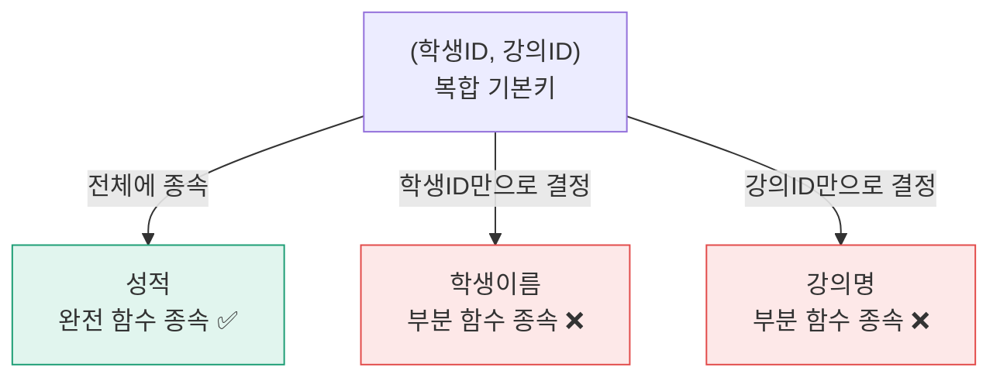
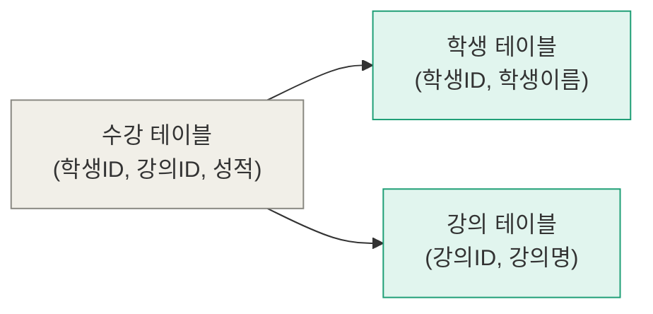
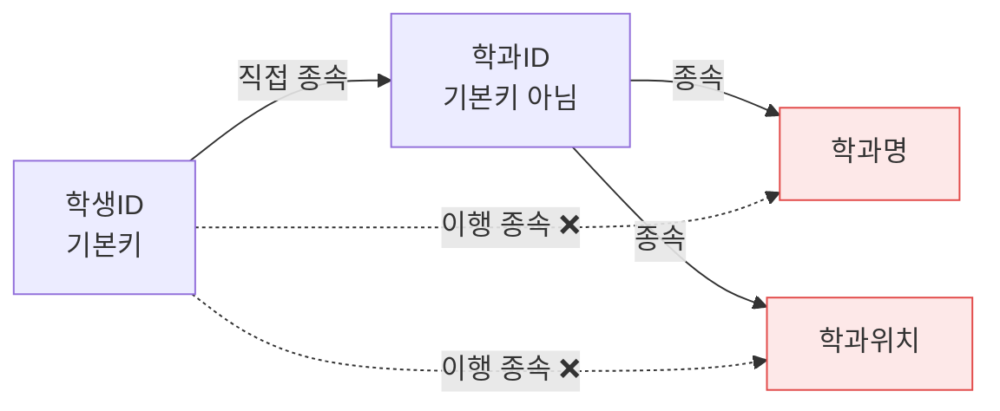
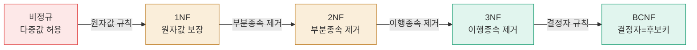
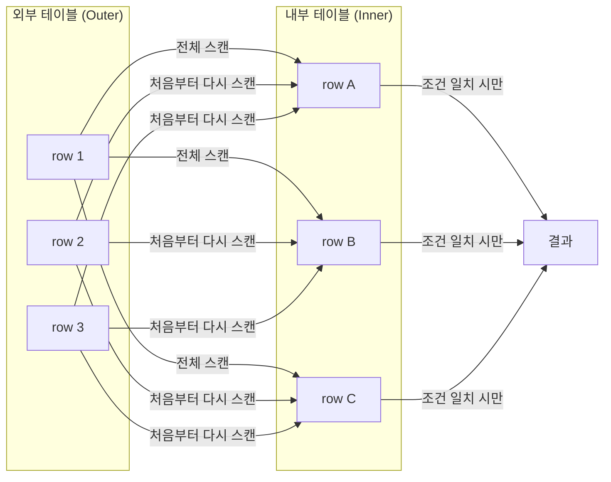
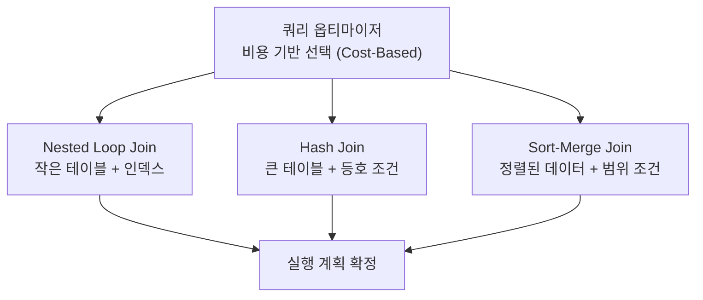

# 정규화와 조인 알고리즘

> 정규화는 테이블을 올바르게 쪼개는 작업이고, 조인 알고리즘은 쪼갠 테이블을 다시 합치는 방법이다. 둘은 동전의 양면이다.

---

## 1. 정규화 (Normalization)

### 1.1 함수 종속 (Functional Dependency)

정규화를 이해하려면 **함수 종속** 개념이 먼저 필요하다.

> X의 값을 알면 Y의 값이 하나로 결정될 때, Y는 X에 함수 종속된다. 표기: X → Y

예시:
- `학생ID → 학생이름` : 학생ID를 알면 이름이 하나로 결정됨 ✅
- `학생ID → 수강강의` : 학생ID 하나에 강의가 여러 개일 수 있음 ❌

#### 기본키(Primary Key)란?

테이블에서 **각 행을 유일하게 구별하는 컬럼**이다.

예를 들어 학생 테이블에서:

|학생ID|학생이름|학과|
|---|---|---|
|1|송은서|컴공|
|2|이철수|전자|
여기서 `학생ID`가 기본키이다. `1`이면 송은서, `2`이면 이철수로 딱 하나씩 결정된다.

##### 기본키가 두 개일 때 — 복합키

근데 기본키가 **두 컬럼을 합쳐서** 만들어지는 경우가 있어.

|학생ID|강의ID|성적|
|---|---|---|
|1|CS101|A|
|1|CS102|B|
|2|CS101|A|

여기서 `학생ID`만으로,  `강의ID`만으로도 구별하지 못한다. **`(학생ID, 강의ID)` 두 개를 합쳐야** 행을 유일하게 구별할 수 있는 것이 **복합키**이다.

##### 그래서 "기본키 전체에 종속"이 뭔 말이냐면

복합키 `(학생ID, 강의ID)`가 기본키일 때:

**성적** → `학생ID=1, 강의ID=CS101` 두 개를 **같이** 알아야 `A`라고 결정돼 → **기본키 전체에 종속** ✅

**학생이름** → `학생ID=1`만 알아도 `송은서`라고 결정돼. 강의ID는 몰라도 됨 → **기본키 일부(학생ID)에만 종속** ❌

> 복합키에서 **두 개 다 있어야** 결정되면 "전체 종속", **하나만으로도** 결정되면 "부분 종속"

|학생ID|강의ID|학생이름|강의명|성적|
|---|---|---|---|---|
|1|CS101|송은서|자료구조|A|
|1|CS102|송은서|운영체제|B|
|2|CS101|이철수|자료구조|A|

각 컬럼이 기본키와 어떤 관계인지 따져본다.

- **성적** → `학생ID=1, 강의ID=CS101` **둘 다** 알아야 결정돼 → 완전 함수 종속 ✅
- **학생이름** → `학생ID=1` **하나만** 알아도 `송은서`로 결정돼 → 부분 함수 종속 ❌
- **강의명** → `강의ID=CS101` **하나만** 알아도 `자료구조`로 결정돼 → 부분 함수 종속 ❌

---
### 1.2 왜 정규화가 필요한가?

정규화 없이 데이터를 하나의 테이블에 몰아넣으면 **이상 현상(Anomaly)** 이 발생한다.

| 학생ID | 학생이름 | 강의ID  | 강의명  | 교수명 | 교수연락처         |
| ---- | ---- | ----- | ---- | --- | ------------- |
| 1    | 송은서  | CS101 | 자료구조 | 박교수 | 010-1111-1111 |
| 1    | 송은서  | CS102 | 운영체제 | 이교수 | 010-2222-2222 |
| 2    | 이철수  | CS101 | 자료구조 | 박교수 | 010-1111-1111 |

이 테이블에서 세 가지 문제가 생긴다.

**삽입 이상 (Insertion Anomaly)**
새로운 강의 CS103을 추가하고 싶은데, 수강하는 학생이 아직 없으면 테이블에 넣을 수가 없다. 기본키에 학생ID가 포함되어 있어서 NULL을 허용하지 않기 때문이다.

**삭제 이상 (Deletion Anomaly)**
이철수가 CS101 수강을 취소해서 해당 행을 삭제하면, "박교수가 CS101 담당이고 연락처는 010-1111-1111이다"라는 정보까지 같이 사라진다.

**갱신 이상 (Update Anomaly)**
박교수 연락처가 바뀌면 박교수가 들어간 모든 행을 수정해야 한다. 하나라도 빠뜨리면 같은 교수가 두 가지 연락처를 가지는 데이터 불일치가 발생한다.

### 왜 이런 문제가 생기냐면
박교수 연락처는 강의 정보인데 학생 수강 테이블에 같이 들어가 있어서다. 서로 다른 성격의 데이터가 한 테이블에 뒤섞인 것이다.

→ 이런 문제를 없애기 위해 테이블을 올바르게 쪼개는 과정이 **정규화**다.

---

### 1.3 1NF — 원자값 규칙

> 각 컬럼은 하나의 원자값(atomic value)만 가져야 한다. 반복 그룹도 허용하지 않는다.

**위반 예시**

| 학생ID | 수강강의          | 전화번호                        |
|--------|-------------------|---------------------------------|
| 1      | CS101, CS102      | 010-1111-1111, 010-2222-2222    |

두 가지 위반이 있다.
- `수강강의` 컬럼에 여러 값이 들어있음
- `전화번호` 컬럼에 여러 값이 들어있음
문인 이유: DB 입장에서는 이 칸이 뭔지 모르기 때문에 하나만 꺼내고 싶어도 꺼낼 수 없다.

**1NF 만족**

| 학생ID | 수강강의 | 전화번호      |
|--------|----------|---------------|
| 1      | CS101    | 010-1111-1111 |
| 1      | CS102    | 010-1111-1111 |

각 셀에 값이 하나씩만 들어가도록 행으로 분리한다.
#### 핵심: 칸 하나 = 값 하나. 여러 개면 행으로 쪼개라.

---

### 1.4 2NF — 부분 함수 종속 제거

> 1NF를 만족하면서, 기본키의 일부에만 종속되는 컬럼을 분리해야 한다.
> **단, 기본키가 단일 컬럼이면 2NF 위반은 발생하지 않는다.**

**위반 예시**

기본키: `(학생ID, 강의ID)`

| 학생ID | 강의ID | 학생이름 | 강의명   | 성적 |
|--------|--------|----------|----------|------|
| 1      | CS101  | 송은서   | 자료구조 | A    |
| 1      | CS102  | 송은서   | 운영체제 | B    |
| 2      | CS101  | 이철수   | 자료구조 | A    |

함수 종속 분석:
- `성적 →(학생ID, 강의ID)` : 완전 함수 종속 ✅, 학생 ID와 강의ID 둘 다 알아야 한다
- `학생이름 → 학생ID` : **부분 함수 종속** ❌, 하나만 알아도 송은서로 결정된다
- `강의명 → 강의ID` : **부분 함수 종속** ❌, 하나만 알아도 자료구조로 결정된다



### 해결법 — 테이블 쪼개기

**2NF 만족 — 테이블 분리**

부분 종속되는 컬럼들을 각자 자기 기본키를 가진 테이블로 분리하면 된다.


**학생 테이블** — 학생ID에만 종속되는 것들
**강의 테이블** — 강의ID에만 종속되는 것들

| 학생 테이블 | | | 강의 테이블 | | | 수강 테이블 | | |
|---|---|---|---|---|---|---|---|---|
| 학생ID | 학생이름 | | 강의ID | 강의명 | | 학생ID | 강의ID | 성적 |
| 1 | 송은서 | | CS101 | 자료구조 | | 1 | CS101 | A |
| 2 | 이철수 | | CS102 | 운영체제 | | 1 | CS102 | B |

---

### 1.5 3NF — 이행 함수 종속 제거

> 2NF를 만족하면서, 기본키가 아닌 컬럼을 거쳐서 종속되는 컬럼을 분리해야 한다.
> A → B → C 형태에서 A가 B를 결정하고, B가 C를 결정하는 상황.
> 이때 A는 기본키인데 B는 기본키가 아닌 경우에 3NF 문제 발생

**위반 예시**

기본키: `학생ID`

| 학생ID | 학생이름 | 학과ID | 학과명       | 학과위치  |
|--------|----------|--------|--------------|-----------|
| 1      | 송은서   | D01    | 컴퓨터공학과 | 공학관 3층 |
| 2      | 이철수   | D01    | 컴퓨터공학과 | 공학관 3층 |
| 3      | 김민지   | D02    | 전자공학과   | 공학관 5층 |

함수 종속 분석:
- `학생ID → 학과ID` ✅
- `학과ID → 학과명, 학과위치` : 학과ID는 기본키가 아닌데 학과명을 결정함
- 결국 학생ID가 기본키인데, 학과ID라는 중간 컬럼을 거쳐서 학과명과 학과위치가 결정되고 있음! **이행 함수 종속** ❌



#### 왜 문제냐면

- 컴퓨터공학과가 공학관 4층으로 이사하면 → D01이 들어간 **모든 행**을 수정해야 함 → 갱신 이상
- 컴공과 학생이 한 명도 없으면 → 컴공과 위치 정보를 저장 못함 → 삽입 이상
- 마지막 컴공과 학생이 자퇴하면 → 컴공과 정보가 통째로 사라짐 → 삭제 이상

2NF랑 똑같은 문제가 반복되고 있지? **서로 다른 성격의 데이터가 한 테이블에 섞여있기 때문이다**

### 해결법 — 중간 컬럼 기준으로 분리

**3NF 만족 — 테이블 분리**
`학과ID`가 중간에서 결정을 하고 있으니까, 학과 관련 정보를 별도 테이블로 빼면 된다.

**학생 테이블**

|학생ID|학생이름|학과ID|
|---|---|---|
|1|송은서|D01|
|2|이철수|D01|
|3|김민지|D02|

**학과 테이블**

| 학과ID | 학과명    | 학과위치   |
| ---- | ------ | ------ |
| D01  | 컴퓨터공학과 | 공학관 3층 |
| D02  | 전자공학과  | 공학관 5층 |


### 2NF vs 3NF 차이 한눈에 보기
|         | 2NF         | 3NF             |
| ------- | ----------- | --------------- |
| 뭘 제거하나  | 부분 함수 종속    | 이행 함수 종속        |
| 언제 발생하나 | 복합키일 때      | 단일키여도 발생 가능     |
| 패턴      | 기본키 일부 → 컬럼 | 기본키 → 일반컬럼 → 컬럼 |
- **"이 컬럼, 기본키 말고 다른 컬럼이 결정하고 있지 않나?"** 싶으면 3NF 위반

---
### 1.6 BCNF — 모든 결정자가 후보키여야 한다

> 3NF보다 조금 더 엄격한 버전.
> 함수 종속 X → Y에서 X가 후보키가 아니면 BCNF 위반이다.

- **후보키** = 기본키가 될 수 있는 컬럼. 즉, 행을 유일하게 구별할 수 있는 컬럼이다.

#### 3NF를 만족해도 BCNF를 위반하는 케이스

**위반 예시**

규칙:
- 한 학생이 한 강의를 한 명의 교수에게만 배운다
- 한 교수는 하나의 강의만 담당한다

기본키: `(학생ID, 강의명)`

| 학생ID | 강의명  | 교수명 |
| ---- | ---- | --- |
| 1    | 자료구조 | 박교수 |
| 2    | 자료구조 | 박교수 |
| 1    | 운영체제 | 이교수 |

함수 종속 분석:
- `(학생ID, 강의명) → 교수명` ✅
- `교수명 → 강의명` : **교수명이 강의명을 결정하는데, 교수명은 후보키가 아님** ❌

#### 이게 왜 문제냐면

- 박교수가 담당 강의를 바꾸면 박교수가 들어간 **모든 행** 수정해야 함 → 갱신 이상
- 아무도 수강 안 하면 박교수가 자료구조 담당이라는 정보를 저장 못함 → 삽입 이상

이 테이블은 3NF는 만족하지만 BCNF는 위반한다.

#### 해결법 — 결정자 기준으로 분리

**BCNF 만족 — 테이블 분리**

| 수강 테이블 | | | 강의 배정 테이블 | |
|---|---|---|---|---|
| 학생ID | 교수명 | | 교수명 | 강의명 |
| 1 | 박교수 | | 박교수 | 자료구조 |
| 2 | 박교수 | | 이교수 | 운영체제 |
| 1 | 이교수 | | | |

> BCNF가 3NF보다 엄격하지만, BCNF 분리 과정에서 **함수 종속 보존이 안 될 수 있다**는 단점이 있다. 실무에서는 이 트레이드오프를 고려해서 3NF에서 멈추는 경우도 있다.

#### 3NF vs BCNF 차이

|       | 3NF      | BCNF                |
| ----- | -------- | ------------------- |
| 조건    | 이행 종속 제거 | 모든 결정자가 후보키         |
| 엄격함   | 덜 엄격     | 더 엄격                |
| 실무 사용 | 많이 씀     | 경우에 따라 3NF에서 멈추기도 함 |

---
### 1.7 4NF, 5NF — 그 이후

BCNF 이후에도 정규형은 계속 존재한다.

| 정규형 | 제거 대상 |
|--------|-----------|
| 4NF | 다치 종속 (Multi-Valued Dependency) |
| 5NF | 조인 종속 (Join Dependency) |

실무에서는 대부분 **3NF 또는 BCNF** 수준에서 설계를 마무리한다. 4NF, 5NF는 이론적으로 존재하지만 실제 서비스에서 적용하는 경우는 드물다.

---

### 1.8 정규화 단계 한눈에 보기



오른쪽으로 갈수록 데이터 중복이 줄고, 테이블 수는 늘어난다.

---

### 1.9 역정규화 (Denormalization)

정규화를 열심히 하면 테이블이 많아진다. 테이블이 많아지면 조인을 많이 해야 하고, 조인이 많으면 느려진다. 정규화를 되돌려서 의도적으로 중복을 허용해 성능을 챙기는 것이 **역정규화**다.

**언제 고려하는가?**
- 특정 쿼리가 너무 많은 테이블을 조인해야 할 때
- 읽기 요청이 압도적으로 많고, 쓰기는 거의 없을 때
- 집계 연산(COUNT, SUM 등)이 매번 반복될 때

#### 구체적인 예시

게시글 목록 페이지가 정규화가 잘 된 상태라면:

- **게시글 테이블**: 게시글ID, 제목, 내용, 작성자ID
- **사용자 테이블**: 사용자ID, 이름, 프로필사진

게시글 목록에 작성자 이름을 보여주려면 매번 이렇게 조인해야 한다

```sql
SELECT 게시글.제목, 사용자.이름
FROM 게시글
JOIN 사용자 ON 게시글.작성자ID = 사용자.사용자ID
```

근데 게시글이 100만 개면? 이 조인을 100만 번 하니까 당연히 느려지게 됨

#### 대표적인 역정규화 방법 세 가지

| 방법 | 설명 | 예시 |
|------|------|------|
| 컬럼 중복 저장 | 자주 조인하는 컬럼을 미리 복사해두기 | 게시글 테이블에 작성자 이름 저장 |
| 집계값 저장 | 매번 계산하지 않고 미리 저장 | 게시글 테이블에 댓글 수 저장 |
| 테이블 병합 | 항상 같이 조회되는 테이블을 하나로 합치기 | 1:1 관계 테이블 병합 |

**1.컬럼 중복 저장** — 자주 조인하는 컬럼을 미리 복사해두기

| 게시글ID | 제목  | 작성자ID | 작성자이름 |
| ----- | --- | ----- | ----- |
| 1     | 안녕  | 1     | 송은서   |
| 2     | 반가워 | 2     | 이철수   |
게시글 테이블에 작성자 이름을 그냥 같이 저장해버리기!
이제 조인 없이 게시글 테이블 하나만 읽으면 되어서 빠르다

**2. 집계값 저장** — 매번 계산하지 않고 미리 저장

```
-- 매번 이걸 계산하는 대신
SELECT COUNT(*) FROM 댓글 WHERE 게시글ID = 1

-- 게시글 테이블에 댓글수 컬럼을 미리 저장해둠
게시글ID | 제목 | 댓글수
1        | 안녕 | 42
```

**3. 테이블 병합** — 항상 같이 조회되는 테이블을 하나로 합치기

1:1 관계인 테이블들은 그냥 합쳐버리는 게 나을 때가 있다.

예를 역정규화로 게시글 테이블에 작성자 이름을 저장했는데, 송은서가 이름을 바꾸면? **게시글 테이블이랑 사용자 테이블 두 곳을 다 수정**해야 한다. 하나라도 빠뜨리면 불일치가 바로 발생.

| 장점              | 단점                  |
|-------------------|-----------------------|
| 조회 성능 향상    | 데이터 중복 발생      |
| 조인 횟수 감소    | 갱신 이상 재발 가능   |
| 쿼리 단순화       | 저장 공간 증가        |

> 그래서 언제 써야 하나면? 역정규화는 **측정 먼저, 최적화는 나중에.**

역정규화는 무조건 하는 게 아니고 순서를 지켜야 한다.

```
1. 일단 정규화된 상태로 만들기
2. 실제로 서비스 돌려보기
3. 느린 쿼리가 어딘지 측정하기  ← 여기서 병목 확인
4. 그 부분만 역정규화 적용하기
```

성능 문제가 생기지도 않았는데 미리 역정규화 하는 건 그냥 데이터 중복만 만드는 것에 불과함.

---

## 2. 조인 알고리즘 (Join Algorithms)

정규화로 쪼갠 테이블을 다시 합칠 때 DB 내부에서는 세 가지 알고리즘 중 하나를 선택해 실행한다.

### 조인 알고리즘이 중요한 이유

정규화를 잘 할수록 조인이 많아진다. 그런데 조인은 공짜가 아니다. 두 테이블에서 조건이 일치하는 행을 찾는 방법은 여러 가지이고, 어떤 방법을 선택하느냐에 따라 수십 배의 성능 차이가 날 수 있다.

---
#### 세 가지 알고리즘 미리 보기

| 알고리즘             | 한 줄 설명                               |
| ---------------- | ------------------------------------ |
| Nested Loop Join | 바깥 테이블 한 행씩 읽으면서, 안쪽 테이블 처음부터 끝까지 스캔 |
| Hash Join        | 한쪽으로 해시 테이블 만들고, 다른 쪽에서 해시로 매칭       |
| Sort-Merge Join  | 둘 다 정렬하고, 포인터 두 개 동시에 움직이며 매칭        |

### 2.1 Nested Loop Join

바깥 테이블을 한 행씩 읽으면서, 각 행마다 안쪽 테이블을 처음부터 끝까지 스캔한다.



```
for each row R1 in 외부 테이블:         ← 외부 루프
    for each row R2 in 내부 테이블:     ← 내부 루프
        if R1.key == R2.key:
            결과에 추가
```

**시간복잡도**: O(M × N) — M, N은 각 테이블의 행 수

#### Index Nested Loop Join

내부 테이블에 인덱스가 있으면 내부 루프를 풀스캔하지 않고 인덱스로 바로 찾을 수 있다.

```
for each row R1 in 외부 테이블:
    인덱스로 내부 테이블에서 R1.key 조회  ← O(log N)
    결과에 추가
```

- 시간복잡도: **O(M × log N)**
- 실무에서 가장 자주 쓰이는 형태

**학생 테이블 (외부), 수강 테이블 (내부)**

| 학생ID | 이름  |     | 학생ID | 강의명  |
| ---- | --- | --- | ---- | ---- |
| 1    | 송은서 |     | 1    | 자료구조 |
| 2    | 이철수 |     | 1    | 운영체제 |
|      |     |     | 2    | 자료구조 |


```
송은서(1)를 읽음 → 수강 테이블 처음부터 스캔
    → 1번 행: 학생ID=1 일치! → 결과에 추가
    → 2번 행: 학생ID=1 일치! → 결과에 추가
    → 3번 행: 학생ID=2 불일치

이철수(2)를 읽음 → 수강 테이블 처음부터 다시 스캔
    → 1번 행: 학생ID=1 불일치
    → 2번 행: 학생ID=1 불일치
    → 3번 행: 학생ID=2 일치! → 결과에 추가
```

외부 테이블 행 수만큼 내부 테이블을 반복해서 읽어. 그래서 시간복잡도가 **O(M × N)** 이야.

#### 인덱스가 있는 Join의 경우

내부 테이블에 인덱스가 있으면 처음부터 끝까지 스캔하지 않고 **인덱스로 바로 찾을 수** 있다.

```
송은서(1)를 읽음 → 인덱스로 학생ID=1인 행 바로 찾기
이철수(2)를 읽음 → 인덱스로 학생ID=2인 행 바로 찾기
```

이걸 **Index Nested Loop Join**이라고 해. 시간복잡도가 **O(M × log N)** 으로 줄기 때문에 실무에서 가장 많이 사용한다.

#### Block Nested Loop Join

인덱스가 없을 때, 행 단위가 아니라 **블록(페이지) 단위**로 읽어서 메모리에 올려두고 디스크 I/O를 줄이는 방식이다.

```
for each block B1 in 외부 테이블:       ← 블록 단위로 읽기
    for each block B2 in 내부 테이블:   ← 블록 단위로 읽기
        블록 안에서 조건 일치 행 찾기
```

- 행 단위 NLJ보다 디스크 I/O가 훨씬 적음
- MySQL 8.0.18 이후에는 BNL 대신 Hash Join이 기본으로 사용됨

**언제 유리한가?**

| 조건 | 이유 |
|------|------|
| 외부 테이블이 작을 때 | 외부 루프 횟수가 줄어듦 |
| 내부 테이블에 인덱스가 있을 때 | Index NLJ로 O(M × log N) 가능 |
| 조인 결과 행 수가 적을 때 | 필터 조건이 강해서 실제 매칭이 적음 |
- 지금은 잘 사용하지 않는다. 인덱스 없을때는 Block보다 빠른 Hash Join을 기본으로 쓰기 때문이다.
---

## 2.2 Hash Join

> 한쪽 테이블로 해시 테이블을 만들고, 다른 쪽을 읽으면서 해시로 매칭한다.

#### 해시 테이블이 뭔지부터

해시 테이블은 **열쇠(key)로 바로 찾아가는 자료구조**이다.

사물함 1번: 송은서 짐
사물함 2번: 이철수 짐
사물함 3번: (비어있음)

"송은서 짐 어딨어?" → 1번 바로 간다. 해시 함수가 "송은서 → 1번 사물함"을 계산해주는 역할로, 조회가 **O(1)** 이다.

### 동작 방식 — 2단계

```mermaid
flowchart LR
  subgraph build["1단계: Build Phase"]
    T1["작은 테이블"] -->|해시 함수| HT["인메모리 해시 테이블\nbucket 1: 송은서\nbucket 2: 이철수"]
  end

  subgraph probe["2단계: Probe Phase"]
    T2["큰 테이블"] -->|해시 조회 O(1)| 결과["결과"]
  end

  HT --> probe
```

**1단계: Build Phase**

작은 테이블을 읽어서 메모리에 해시 테이블을 만든다.

- 학생ID=1, 송은서 → hash(1) = bucket 1에 저장
- 학생ID=2, 이철수 → hash(2) = bucket 2에 저장

완성된 해시 테이블:
- bucket 1: {학생ID=1, 이름=송은서}
- bucket 2: {학생ID=2, 이름=이철수}

**2단계: Probe Phase**

큰 테이블을 읽으면서 해시 테이블에서 매칭되는 걸 찾는다.
작은 테이블 전체를 볼 필요 없이 **해당 bucket 하나만** 보면 되는 것이다.

- 학생ID=1, 자료구조 → hash(1) → bucket 1 조회 → 송은서 찾음 → 결과에 추가
- 학생ID=1, 운영체제 → hash(1) → bucket 1 조회 → 송은서 찾음 → 결과에 추가
- 학생ID=2, 자료구조 → hash(2) → bucket 2 조회 → 이철수 찾음 → 결과에 추가

#### NLJ랑 비교하면

NLJ는 큰 테이블의 각 행마다 작은 테이블을 **처음부터 끝까지 반복해서 읽는다.**
Hash Join은 작은 테이블을 **딱 한 번만** 읽어서 해시 테이블을 만들고, 이후엔 O(1)로 바로 찾아간다.

그래서 전체 복잡도가 **O(M + N)** 이다.
- Build Phase: 작은 테이블 한 번 읽기 → O(M)
- Probe Phase: 큰 테이블 한 번 읽으면서 O(1) 조회 → O(N)

#### 메모리 이슈

해시 테이블을 **메모리에 올려야** 한다. 작은 테이블이 메모리에 다 들어가야 성능이 나온다.

메모리 충분 → 해시 테이블 전부 메모리에 올림 → 빠름
메모리 부족 → Grace Hash Join으로 디스크에 나눠서 처리 → 디스크 I/O 발생 → 느려짐

#### 등호(=) 조인에서만 사용 가능

해시는 "이 키가 이 bucket에 있나?"를 찾는 구조다. 범위 조건은 처리하지 못한다.
```sql
-- Hash Join 가능
ON A.id = B.id

-- Hash Join 불가능 (범위 조건)
ON A.id BETWEEN B.start AND B.end
```

범위 조건이 있을 때는 Sort-Merge Join이 대신 쓰인다.

#### 언제 유리한가?

| 조건            | 이유                  |
| ------------- | ------------------- |
| 두 테이블이 모두 클 때 | NLJ는 O(M×N)이라 너무 느림 |
| 인덱스가 없을 때     | 인덱스 없이도 O(M+N) 가능   |
| 등호(=) 조인일 때   | 해시는 범위 조건 불가        |
| 메모리가 충분할 때    | 해시 테이블을 메모리에 올려야 함  |

---

### 2.3 Sort-Merge Join

두 테이블을 조인 컬럼 기준으로 각각 정렬한 뒤, 양쪽 포인터를 동시에 움직이며 매칭한다.

### 1단계: Sort Phase

두 테이블을 조인 컬럼 기준으로 각각 정렬해.

**학생 테이블 정렬 후**

|학생ID|이름|
|---|---|
|1|송은서|
|2|이철수|
|3|김민수|

**수강 테이블 정렬 후**

|학생ID|강의명|
|---|---|
|1|자료구조|
|1|운영체제|
|2|자료구조|
|4|알고리즘|

둘 다 학생ID 기준으로 정렬된 상태야.

---

### 2단계: Merge Phase

양쪽에 포인터를 하나씩 두고 동시에 움직이면서 비교해.

```
학생  포인터→ 1(송은서)
수강  포인터→ 1(자료구조)
→ 둘 다 1 → 일치! 결과에 추가

학생  포인터→ 1(송은서) (아직 유지)
수강  포인터→ 1(운영체제)
→ 둘 다 1 → 일치! 결과에 추가

학생  포인터→ 1(송은서) (아직 유지)
수강  포인터→ 2(자료구조)
→ 수강이 더 큼 → 학생 포인터 전진

학생  포인터→ 2(이철수)
수강  포인터→ 2(자료구조)
→ 둘 다 2 → 일치! 결과에 추가

학생  포인터→ 2(이철수) (아직 유지)
수강  포인터→ 4(알고리즘)
→ 수강이 더 큼 → 학생 포인터 전진

학생  포인터→ 3(김민수)
수강  포인터→ 4(알고리즘)
→ 수강이 더 큼 → 학생 포인터 전진

학생  포인터→ 끝
→ 종료
```

**시간복잡도**:
- 정렬 비용: O(M log M + N log N)
- 병합 비용: O(M + N)
- 인덱스가 이미 정렬되어 있다면 정렬 비용 생략 → O(M + N)

**Hash Join과의 차이**

Hash Join은 등호 조건만 가능하지만, Sort-Merge Join은 **범위 조건**도 처리할 수 있다.

```sql
-- Hash Join 가능
SELECT * FROM A JOIN B ON A.id = B.id

-- Sort-Merge Join이 유리
SELECT * FROM A JOIN B ON A.id BETWEEN B.start AND B.end
```

**언제 유리한가?**

| 조건 | 이유 |
|------|------|
| 이미 정렬된 데이터 (인덱스) | 정렬 비용 없이 병합만 하면 됨 |
| 범위 조건 조인 | Hash Join이 처리 못하는 케이스 |
| 두 테이블 모두 클 때 | NLJ보다 효율적 |

---

### 2.4 세 알고리즘 비교

| 알고리즘    | 복잡도                       | 유리한 조건                           | 불리한 조건            |
|-------------|------------------------------|---------------------------------------|------------------------|
| Nested Loop | O(M × N)                     | 외부 테이블 작음, 내부에 인덱스 있음   | 두 테이블 모두 클 때   |
| Hash Join   | O(M + N)                     | 두 테이블 모두 큼, 등호 조인           | 메모리 부족, 범위 조건 |
| Sort-Merge  | O(M log M + N log N)         | 이미 정렬된 데이터, 범위 조건          | 무작위 순서 데이터     |

---

### 2.5 옵티마이저는 어떻게 선택하나?

개발자가 알고리즘을 직접 고르는 게 아니라 **쿼리 옵티마이저**가 자동으로 비용을 계산해서 선택한다.



옵티마이저가 보는 주요 기준:

| 기준             | 영향                                      |
|------------------|-------------------------------------------|
| 테이블 크기      | 작은 테이블이 있으면 Nested Loop 선호      |
| 인덱스 존재 여부 | 인덱스 있으면 Index Nested Loop 선택       |
| 조인 조건 종류   | 등호(=)면 Hash, 범위면 Sort-Merge 고려     |
| 가용 메모리      | 메모리 부족하면 Hash Join 회피             |
| 통계 정보        | 행 수, 카디널리티 추정으로 비용 계산       |

**조인 순서(Join Order)도 성능에 영향을 준다**

테이블이 3개 이상이면 어떤 순서로 조인할지도 결정해야 한다. 일반적으로 **결과 행 수가 가장 적은 조인을 먼저** 수행하는 게 유리하다.

```sql
SELECT * FROM 학생 JOIN 수강 ON ... JOIN 강의 ON ...
```

이때 옵티마이저가 선택할 수 있는 순서:

```
학생 + 수강 먼저 → 그 결과 + 강의
학생 + 강의 먼저 → 그 결과 + 수강
수강 + 강의 먼저 → 그 결과 + 학생
```

일반적으로 **중간 결과가 가장 작아지는 순서**를 선택한다. 중간 결과가 크면 다음 조인에서 처리해야 할 양이 많아지기 때문.

```
테이블 크기: 학생(100만) 수강(500만) 강의(100개)

나쁜 순서: 학생 + 수강 → 중간 결과 클 수 있음
좋은 순서: 강의 + 수강 먼저 → 강의가 100개라 중간 결과 작
```

> 통계 정보가 오래됐거나 없으면 옵티마이저가 잘못된 선택을 할 수 있다. 주기적인 `ANALYZE TABLE`이 중요한 이유다. 그래서 EXPLAIN으로 확인하는 습관이 필요하다.

---

### 2.6 EXPLAIN으로 실제 확인하기

옵티마이저가 어떤 선택을 했는지는 `EXPLAIN`으로 볼 수 있다.

```sql
EXPLAIN SELECT s.학생이름, c.강의명, sc.성적
FROM 수강 sc
JOIN 학생 s ON sc.학생ID = s.학생ID
JOIN 강의 c ON sc.강의ID = c.강의ID
WHERE s.학과ID = 'D01';
```

**주요 컬럼**

| 컬럼       | 의미               | 주의 신호                                        |
|------------|--------------------|--------------------------------------------------|
| `type`     | 조인 방식          | `ALL`이면 풀스캔 → 인덱스 추가 고려              |
| `key`      | 실제 사용된 인덱스 | `NULL`이면 인덱스 미사용                         |
| `rows`     | 예상 스캔 행 수    | 숫자가 클수록 느리다는 신호                      |
| `filtered` | 조건 통과 예상 비율 | 낮으면 불필요한 행을 많이 읽고 있다는 뜻        |
| `Extra`    | 추가 정보          | `Using filesort`, `Using temporary` → 튜닝 필요 |

**type 컬럼 해석 (빠른 순)**

| type | 의미 |
|------|------|
| `const` | 기본키 또는 유니크 인덱스로 단 1건 조회 |
| `eq_ref` | 조인에서 기본키/유니크 인덱스로 1건 매칭 |
| `ref` | 일반 인덱스로 조회 |
| `range` | 인덱스 범위 스캔 |
| `index` | 인덱스 풀스캔 (테이블 풀스캔보다는 낫지만 느림) |
| `ALL` | 테이블 풀스캔 ← 가장 느림, 인덱스 추가 고려 |

**EXPLAIN 결과 예시**

인덱스 없이 조인할 때:
```
id | type | key  | rows   | Extra
---+------+------+--------+--------------------
1  | ALL  | NULL | 100000 | Using where
2  | ALL  | NULL | 50000  | Using join buffer
```

인덱스 추가 후:
```
id | type   | key     | rows | Extra
---+--------+---------+------+-------
1  | ref    | idx_학과 | 1000 | Using index
2  | eq_ref | PRIMARY | 1    |
```

`rows`가 100000 → 1000으로 줄고, `type`이 `ALL` → `ref`로 바뀐 것을 확인할 수 있다.

---

## 3. 정리


- **정규화**는 데이터 중복과 이상 현상을 없애기 위해 테이블을 올바르게 쪼개는 작업이다
- 쪼갤수록 **조인이 늘어나고**, 조인이 늘어날수록 알고리즘 선택이 성능에 직결된다
- **역정규화**는 조인 비용이 실제로 문제가 될 때, 의도적으로 중복을 허용해서 성능을 챙기는 것이다
- EXPLAIN은 옵티마이저가 내린 결정을 들여다보는 창이다. `type=ALL`, `key=NULL`이 보이면 튜닝 포인트다

> 측정 먼저, 최적화는 나중에.
