# 1. 가상화(Virtualization)의 등장 배경

## 1-1. OS가 제공하는 추상화와 가상화

컴퓨터 하드웨어는 실제로는 제한된 자원만 가지고 있다.

예를 들어 CPU가 8코어인 컴퓨터라면 물리적으로 동시에 실행할 수 있는 작업 수에는 한계가 있다. 하지만 사용자는 여러 프로그램을 동시에 실행한다. (Chrome, IntelliJ, Discord, Database, Game 등등)


사용자는 각각의 프로그램이 독립적인 컴퓨터에서 실행되는 것처럼 느낀다.
하지만 실제로는 하나의 하드웨어 자원을 여러 프로그램이 공유하고 있다.
이때 OS가 중간에서 **추상화(abstraction)** 를 제공한다.

추상화란 복잡한 내부 동작을 숨기고, 사용자가 더 단순한 인터페이스로 사용할 수 있게 만드는 것이다.


사용자는 CPU 코어를 직접 관리하지 않고 Process를 실행한다.
메모리 주소도 실제 RAM 주소가 아니라 Virtual Address를 사용한다.

| 실제 하드웨어 | OS가 제공하는 추상화          |
| ------- | --------------------- |
| CPU     | Process               |
| Memory  | Virtual Address Space |
| Disk    | File System           |
| Network | Socket                |

> 즉 OS는 "물리 자원을 그대로 노출하지 않고,
> 사용하기 편한 가상의 자원으로 제공"한다.

## 1-2. 가상화가 필요한 이유

> 물리 서버 환경의 문제

OS 수준의 가상화만으로도 많은 문제가 해결되었지만, 서버 환경에서는 더 큰 문제가 발생했다.

초기 서버 구조는 하나의 물리 서버에 하나의 애플리케이션을 실행하는 형태가 많았다.

구조:
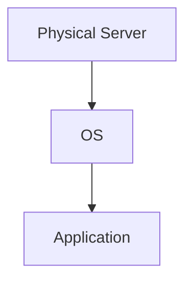

예:

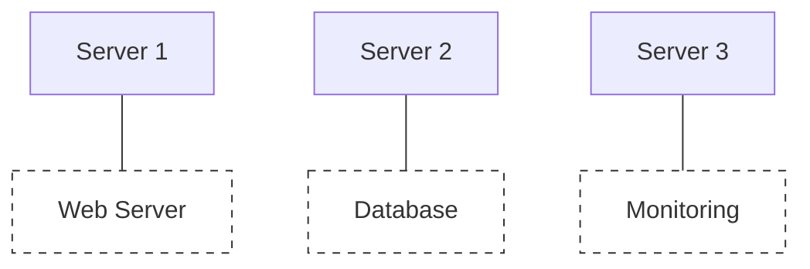

이 구조의 문제는 서버 자원을 효율적으로 사용하지 못한다는 점이다.

하나의 애플리케이션이 CPU와 Memory를 많이 사용하지 않는 경우에도 서버 전체를 점유하게 된다.

```
Server A

CPU 사용률: 10%
Memory 사용률: 20%
다른 서비스는 실행 불가
```

즉 하드웨어는 남아있지만 사용할 수 없는 자원이 된다.

이를 **자원 활용률(Resource Utilization) 문제**라고 한다.
## 1-3. 환경 의존성 문제
> Virtual Machine과 Container가 해결하려는 문제

서버 운영에서 또 다른 큰 문제는 "환경 차이"
애플리케이션은 코드만으로 동작하지 않음

실행에는 아래와 같은 여러 환경 요소가 필요함.

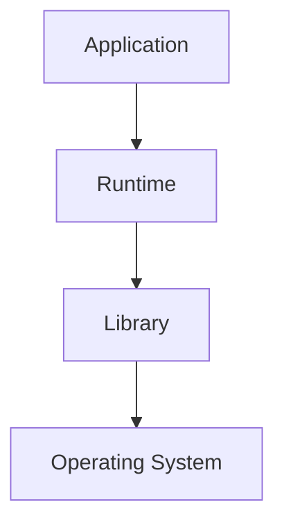

예를 들어 Java 애플리케이션이라면 다음과 같이 영향을 받음

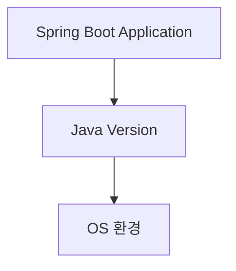

개발자의 환경과 운영 서버의 환경이 다르다면 같은 코드라도 예상하지 못한 문제가 발생할 수 있다.

예시
개발자의 환경:

```
개발 PC

Ubuntu 22.04
Java 21
Spring Boot
```

운영 서버:

```
Server

Ubuntu 20.04
Java 17
Spring Boot
```

대표적인 문제:

- OS 차이
- 라이브러리 버전 차이
- 설정 차이
- 설치 과정 차이

결과적으로 개발자가 겪는 상황은

```
제 컴퓨터에서는 되는데요?
제 컴퓨터에서는 안되는데요?
```

가상화는 이런 환경 차이를 줄이는 방향으로 발전했다.

## 1-4. Virtual Machine의 등장

> **가상화의 핵심 아이디어**
> : "하나의 물리 컴퓨터 위에 여러 개의 독립된 컴퓨터를 만드는 것"

기존 구조에서 가상화 이후로의 변화 (여러 개의 독립된 컴퓨터)

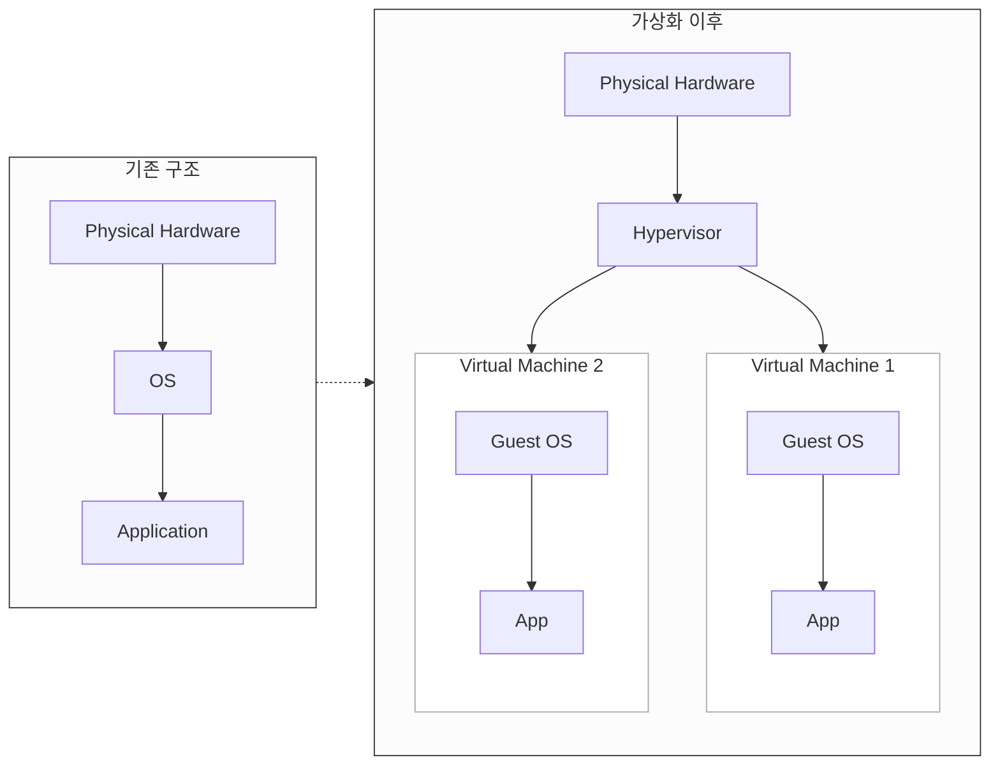

각 Virtual Machine은 자신만의 자원을 가진 것처럼 동작한다.
- CPU
- Memory
- Disk
- Network
- Operating System

즉 하나의 물리 서버에서 다음과 같은 구조를 만들 수 있다.

```
Server 1
 └── VM 1
      └── Ubuntu
          └── Web Server
          
 └── VM 2
      └── Ubuntu
          └── Database
```

## ## 1-5. VM 이후 Container까지의 큰 흐름
VM은 서버 활용 문제를 크게 개선했다.

하지만 새로운 문제가 생겼는데
**각 VM은 아래와 같이 독립된 OS를 가지고 있어야 한다.**
따라서 동일한 Linux Kernel이 여러 번 실행된다.

```
VM 1
 └── Linux Kernel

VM 2
 └── Linux Kernel

VM 3
 └── Linux Kernel
```

이 때문에
- 메모리 사용량 증가
- 실행 시간 증가
- 관리 복잡성 증가

그래서 나온게 바로 Container
> "컴퓨터 전체를 가상화하지 않고, 애플리케이션 실행 환경만 격리할 수 없을까?"

Container에 대해서는 이번에 깊게 다루지 않는다.

---
# 2. Virtual Machine의 구조와 원리

## 2-1. Virtual Machine이란?
Virtual Machine(VM)은 하나의 물리적인 컴퓨터 위에서 **소프트웨어적으로 만들어진 독립적인 컴퓨터 환경**이다.

일반적인 컴퓨터 구조에서는 하나의 하드웨어 위에 하나의 운영체제가 실행된다.
```
Physical Machine

Hardware
    |
Operating System
    |
Application
```

하지만 VM 환경에서는 하나의 물리 머신 위에서 여러 개의 가상 머신이 실행된다.

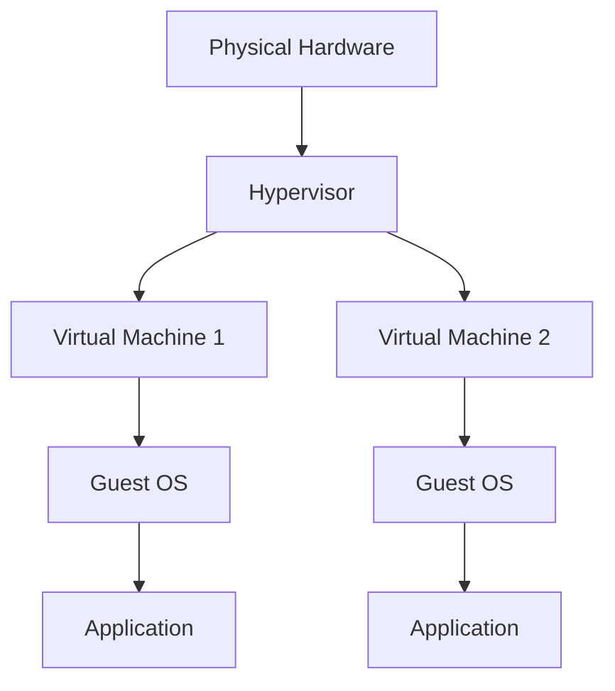

각 VM은 자신만의 운영체제와 애플리케이션을 가진다.

예를 들어 하나의 서버에서 아래와 같이 서로 다른 OS와 프로그램을 동시에 실행할 수 있다.
```
Physical Server

VM 1
 ├ Ubuntu
 └ Spring Boot Application

VM 2
 ├ Windows Server
 └ Database

VM 3
 ├ CentOS
 └ Monitoring Tool
```

## 2-2. VM의 전체 구조 (Host OS, Hypervisor, Guest OS)
VM 구조를 이해하기 위해서는 세 가지 요소를 구분해야 한다.

| **구성 요소**      | **역할**                                                     |
| -------------- | ---------------------------------------------------------- |
| **Host OS**    | **실제 컴퓨터의** 물리 하드웨어를 제어하고 관리하는 **운영체제**                    |
| **Hypervisor** | **사이 중간 역할**,<br>물리 자원을 분할하여 가상 머신(VM)을 생성하고 관리하는 소프트웨어 계층 |
| **Guest OS**   | **가상 머신(VM) 내부**의 독립된 환경에서 실행되는 각각의 **운영체제**               |
- Guest OS
	- Guest OS는 실제 하드웨어를 직접 제어하지 X
	- Guest OS 입장에서는 CPU, Memory, Disk, Network가 있다고 생각하지만 실제로는 가상 장치임
- Hypervisor
	- Guest OS가 하드웨어를 요청하면 Hypervisor가 실제 하드웨어 작업으로 변환함
	- 담당하는 역할
		- VM 생성
		- CPU 시간 분배
		- Memory 할당
		- Disk/Network 제공
		- VM 간 격리
## 2-3. Virtual Hardware와 Hardware Abstraction
> **VM의 핵심 아이디어**
    : "Guest OS가 실제 하드웨어가 있다고 믿도록 만드는 것"

Guest OS는 자신이 물리 컴퓨터 위에서 실행되고 있다고 생각한다.

예를 들어
	Ubuntu VM에서 `lscpu`를 실행하면 CPU 정보가 나오지만,
	그 CPU는 실제 CPU가 아니라 Hypervisor가 제공한 **Virtual CPU**

구조는 다음과 같음
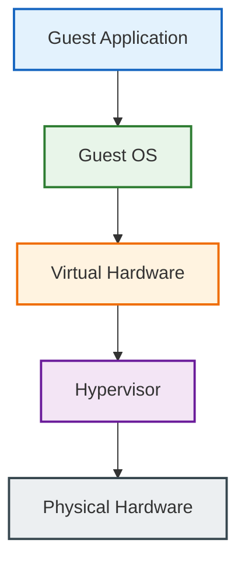

**VM이 제공하는 가상 장치**
Physical Server의 자원을 나누어 Guest OS에게 할당

|**실제 장치 (Physical)**|**VM에서 보이는 가상 장치 (Virtual)**|
|---|---|
|**Physical CPU** (물리 프로세서)|**vCPU** (가상 CPU)|
|**Physical Memory** (물리 메모리)|**vRAM** (가상 메모리)|
|**Physical Disk** (물리 디스크)|**Virtual Disk** (가상 디스크)|
|**Physical Network Card** (물리 랜카드)|**vNIC** (가상 네트워크 카드)|

## 2-4. Guest OS와 Host OS의 실행 관계

Guest OS도 일반 OS처럼 동작하며 다음 작업을 모두 수행한다.
- Process 관리
- Memory 관리
- File System 관리
- Network 관리

Host OS, Guest OS 모두가 동시에 자원을 관리한다
즉, Process Scheduler가 각각 존재해 프로세스 스케줄링이 두 단계로 발생
이 부분은 이후 Hypervisor 동작 방식에서 더 자세히 다룸
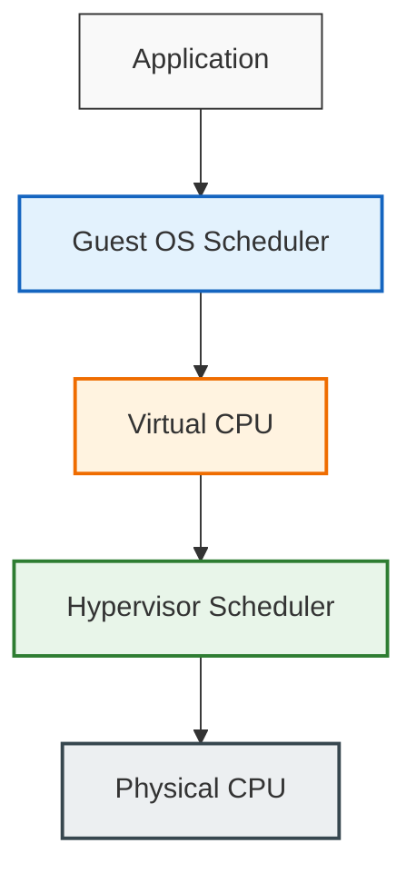

## 2-5. VM에서 프로그램 실행 흐름
VM은 "컴퓨터 안의 컴퓨터"임
VM은 단순히 프로그램을 실행하는 것이 아니라,
**컴퓨터 환경 전체를 추상화한다.**

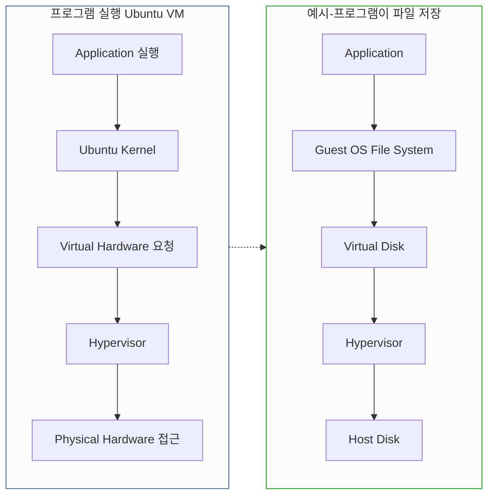

---
# 3. Hypervisor의 동작 방식  
## 3-1. Hypervisor가 필요한 이유와 역할
VM의 핵심 아이디어는 **하나의 물리 컴퓨터 위에서 여러 개의 독립된 컴퓨터를 실행하는 것**이다.

그런데 여기서 문제는
Guest OS 입장에서는 자신이 실제 컴퓨터의 주인이라고 생각한다.

예를 들어 VM 안의 Ubuntu는 CPU, Memory, Disk, Network가 실제로 존재한다고 생각하지만, 실제로는 Physical Server의 자원을 여러 VM이 공유하고 있다.

따라서 중간 자원 관리 주체가 필요 → Hypervisor
- 어떤 VM에게 CPU를 얼마나 줄지
- 어떤 VM이 사용할 Memory 영역인지
- Disk 접근을 어떻게 처리할지
- VM끼리 서로 침범하지 못하도록 어떻게 막을지
### Hypervisor의 기능과 역할
단순히 "VM을 실행하는 프로그램"이 X
실제로는 운영체제와 비슷한 역할을 수행
- 기존 OS
	- OS가 Application에게 추상화된 자원을 제공
	- OS는 Application을 가상화
- VM 환경
	- Hypervisor가 Guest OS에게 가상의 하드웨어를 제공
	- Hypervisor는 Machine 자체를 가상화

Hypervisor의 주요 역할은 크게 세 가지

| **주요 역할**                           | **설명**                                  |
| ----------------------------------- | --------------------------------------- |
| **Resource Allocation** (자원 할당)     | 물리 자원을 여러 가상 머신(VM)에게 효율적으로 분배          |
| **Isolation** (격리성)                 | (보안 및 안정성을 위해) 다른 VM끼리 서로 영향을 주지 않도록 격리 |
| **Hardware Abstraction** (하드웨어 추상화) | 실제 장치를 가상 장치(vCPU, vRAM 등)로 변환해 제공      |
## 3-2. Type 1 Hypervisor (Bare Metal)  

Type 1 Hypervisor는 하드웨어 위에서 직접 실행된다.
Host OS가 존재하지 않고, Hypervisor가 직접 하드웨어를 관리한다.
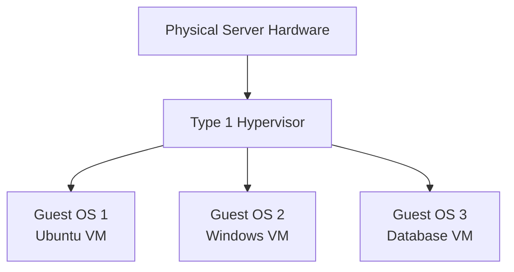
- 장점 : 중간 계층이 적음
- 특징
	- 성능 오버헤드 감소
	- 자원 관리 효율 증가
	- 안정적인 격리
- 주요 사용 환경 : 주로 데이터센터, 클라우드 환경에서 사용됨
- 대표 예시 : - VMware ESXi, Microsoft Hyper-V, KVM 기반 시스템

## 3-3. Type 2 Hypervisor (Hosted)  

Type 2 Hypervisor는 일반 프로그램처럼 Host OS 위에서 실행된다.

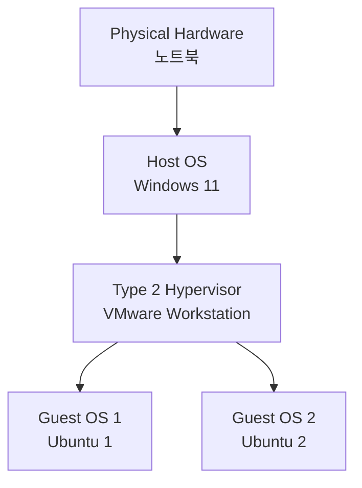
- 장점:
	- 설치가 쉬움
	- 개발 환경 구성 편리
	- 개인 PC에서 사용하기 좋음
- 단점
	- Host OS를 거쳐야 하기 때문에 추가 계층이 존재
	- Hardware 접근 과정이 더 길어짐

## 3-4. Type 1과 Type 2 비교  
> 둘의 가장 큰 차이
> : "누가 먼저 하드웨어를 관리하는가"
	- Type 1 : Hypervisor
	- Type 2 : Host OS

| **구분**         | **Type 1** | **Type 2**    |
| -------------- | ---------- | ------------- |
| **실행 위치**      | Hardware 위 | Host OS 위     |
| **Host OS 필요** | 없음         | 필요            |
| **성능**         | 높음         | 상대적으로 낮음      |
| **목적**         | 서버/클라우드    | 개발/개인 환경      |
| **안정성**        | 높음         | Host OS 영향 가능 |
## 3-5. CPU Virtualization 동작 원리  
VM에서 가장 중요한 부분 중 하나는 CPU 가상화다.

**문제 : Guest OS도 CPU를 관리하려고 한다는 점**
	**→ 스케줄러가 두 단계 존재**

- 초기 가상화
	- CPU 명령을 모두 소프트웨어로 변환해야 했다.
	- 느리고, 구현 복잡한 문제
- 기술 도입
	- CPU 제조사에서 하드웨어 지원 기능을 추가 (Intel VT-x, AMD-V)
	- CPU가 "이 명령은 Host OS 명령인지 Guest OS 명령인지" 구분할 수 있게 됨

## 3-6. Memory Virtualization 동작 원리  

VM에서는 일반 Process에 대해 메모리 가상화 동작에 비해 한 단계 추가됨
1. Application은 Guest OS의 Virtual Address 사용
2. Guest OS는 Guest Physical Address로 변환
3. Hypervisor가 실제 Physical Memory로 변환
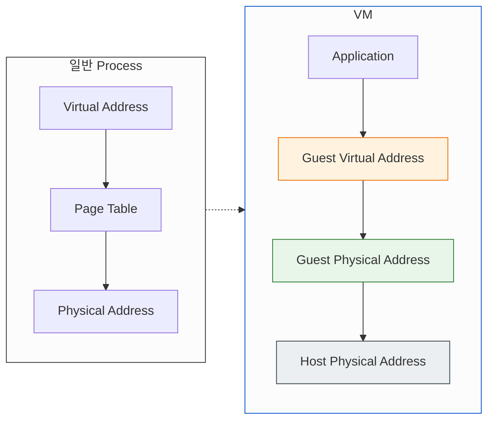
```
(예시)
Application
주소 1000
↓
Guest OS
주소 5000
↓
Hypervisor
실제 RAM 주소 80000
```

- 초기
	- Hypervisor가 이 변환을 직접 관리
	- 대표적 기술 **Shadow Page Table**
	- Hypervisor가 Guest OS의 Page Table을 대신 관리
- 문제
	- Guest OS가 Page Table을 변경할 때마다 Hypervisor가 동기화해야 함.
- 현재
	- CPU가 직접 Guest Address → Host Address 변환을 지원해 빠르게 처리
	- 대표 기술 : Intel EPT, AMD NPT
## 3-7. Device Virtualization 동작 원리  

CPU와 Memory뿐 아니라 장치도 가상화해야 한다.
Guest OS는 Disk, Network Card, GPU 필요

하지만 실제 장치는 하나기 때문에 Hypervisor가 가상 장치를 제공한다.

Disk 예시
- Guest OS : `/dev/sda → 내 Disk` 라고 생각
- 실제 : `Virtual Disk → Image File → Physical Disk` 구조

Network도 동일
- Guest OS: `Virtual NIC → IP 주소` 를 가짐
- 실제 : `Virtual NIC → Hypervisor Network → Physical NIC`를 거침

## 3-8. Hardware Virtualization 지원 기술
현대 VM이 빠르게 동작하는 이유
: CPU와 하드웨어가 가상화를 고려해서 설계되었기 때문
- 예전 방식 : Guest OS 요청 시 Hareware를 Software 변환
- 현재 방식 : Guest OS 요청 시 Physical Hardware 변환에 Hardware 지원

| 기술         | 역할                   |
| ---------- | -------------------- |
| Intel VT-x | CPU 가상화 지원           |
| AMD-V      | CPU 가상화 지원           |
| EPT        | Memory Address 변환 지원 |
| IOMMU      | Device 접근 가상화        |
---
# 4. VM의 한계와 Container의 등장  
## 4-1. VM이 해결한 문제

VM은 기존 서버 환경에서 발생하던 여러 문제를 해결하기 위해 등장했다.

가장 큰 변화는 하나의 물리 서버에서 여러 개의 독립적인 실행 환경을 만들 수 있게 된 것이다.

기존과 같이 하나의 서버가 하나의 서비스만 담당하는 것이 아니라
VM을 사용하면 하나의 하드웨어 위에서 여러 환경을 실행할 수 있다.

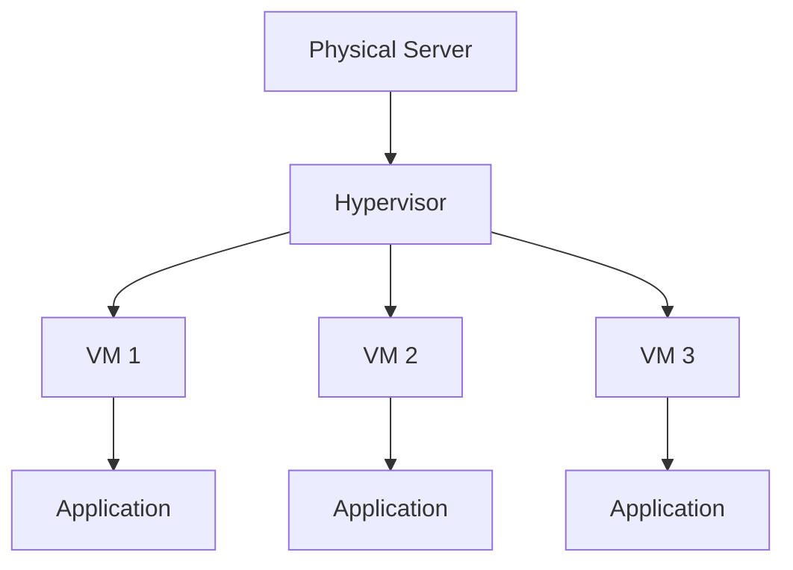

#### 장점1 자원 활용률이 증가됨
- 서버 구매 비용 감소
- 자원 활용률 증가
- 관리 효율 증가

예전 : 서버 자원이 남아도 다른 서비스 실행 불가
```
Server A

CPU 사용률: 10%
Memory 사용률: 15%
```
VM : 하나의 서버 자원을 여러 서비스가 공유
```
Physical Server

VM 1 → Web Server
VM 2 → Database
VM 3 → Monitoring
```

#### 장점2. 환경 독립성 제공
- VM은 운영체제까지 포함한 실행 환경을 제공할 수 있음
- Image를 그대로 이동할 수 있게 됨
	→ 따라서 개발 환경과 운영 환경 차이를 줄일 수 있음
```
VM Image 

Ubuntu 22.04
Java 17
Spring Boot
Application
```

## 4-2. VM 구조에서 발생하는 오버헤드  
VM은 강력한 격리를 제공하지만 그만큼 비용이 발생
> 가장 큰 원인
> : 각 VM이 독립적인 운영체제를 포함한다는 점

VM 방식을 이용하면 각 VM마다 Kernel이 필요하다.
하지만 서비스가 모두 Linux 기반이라면 Linux Kernel이 동일하게 반복됨
```
VM 1
 ├ Application
 └ Linux Kernel
VM 2
 ├ Application
 └ Linux Kernel
VM 3
 ├ Application
 └ Linux Kernel
```

#### 단점1. Memory 사용 증가
Guest OS도 메모리를 사용하기 떄문에
Application이 아닌 OS 자체가 메모리를 차지
```
Physical RAM 16GB

VM 1
 └ Guest OS 2GB
VM 2
 └ Guest OS 2GB
VM 3
 └ Guest OS 2GB
```
#### 단점2. 시작 시간이 길다 (=부팅 필요)
VM을 실행한다는 것은 작은 컴퓨터를 부팅하는 것
→ 실행까지 시간이 필요

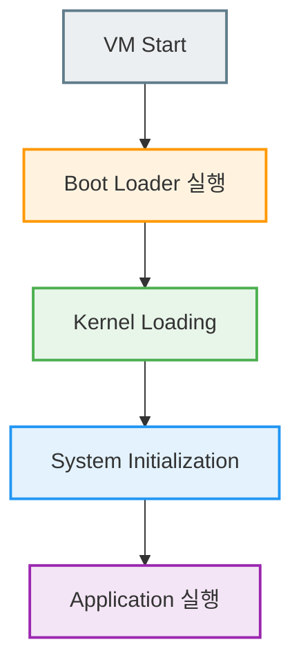
## 4-3. VM의 구조적 한계  
VM의 문제는 단순히 "느리다"가 아니라
근본적인 원인은 **가상화 대상이 너무 크다는 것**이다.

`Hardware 전체 가상화 : CPU, Memory, Disk, Network, OS, Application`

하지만 많은 경우 우리가 원하는 것은 "다른 컴퓨터가 필요한 것" 이 아니라
**"동일한 실행 환경에서 애플리케이션을 격리해서 실행하는 것"임

웹 서버 10개를 실행한다고 할 때:
- 필요한 것 : `Application, Runtime, Library, Configuration`
- 실제로 실행하는 것 : `Linux Kernel 10개'

따라서
> **"OS 전체를 가상화하지 않고,**
> **애플리케이션 실행 환경만 격리할 수 없을까?"**
> 
> 라는 질문에서부터 Container가 시작됨

## 4-4. Container가 등장한 배경
Container는 VM과 다른 접근 방식을 선택함
- VM : Hardware를 가상화
- Container : OS 위에서 실행 환경을 격리
	- 여러 Container는 같은 Kernel을 공유
	- Container 내부에서 Application, Runtime, Library, Filesystem은 독립적으로 보이지만 Host Kernel 하나를 사용함
	- 특징
		- VM보다 가벼움
		- 빠른 시작
		- 적은 메모리 사용
		- 높은 배포 효율

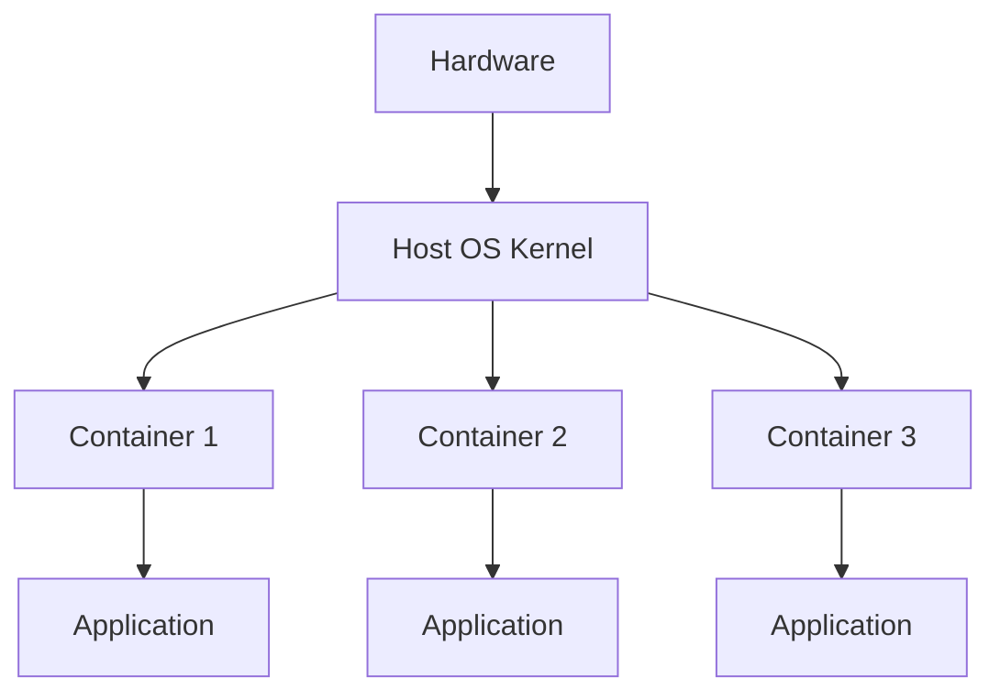

#### 중요한 차이점
- VM
	- Guest OS까지 격리
	- VM은 격리 수준이 더 강함
- Container
	- OS Kernel 공유
	- Container는 효율성이 높음

트레이드오프가 존재함
---
# 핵심 정리
## 1장 핵심 정리

가상화는 갑자기 등장한 기술이 아니라 OS가 하던 역할의 확장이다.

흐름:
```
Physical Resource
        |
        ↓
OS Virtualization

CPU → Process
Memory → Virtual Memory

        |
        ↓

Machine Virtualization

Hardware → Virtual Machine

        |
        ↓

OS-level Virtualization

Process → Container
```
---
## 2장 핵심 정리

VM은 하드웨어를 직접 공유하지 않고,
Hypervisor가 만든 가상 하드웨어 위에서 Guest OS를 실행하는 방식이다.

핵심 구조:
```
Physical Hardware
        |
        ↓
    Hypervisor
        |
        ↓
   Virtual Hardware
        |
        ↓
    Guest OS
        |
        ↓
 Application
```

VM의 핵심 특징:
- 운영체제까지 포함한 완전한 실행 환경 제공
- 강한 격리
- 다른 OS 실행 가능
- 대신 OS 중복으로 인해 무거움
---
## 3장 핵심 정리
Hypervisor는 VM을 가능하게 만드는 핵심 계층이다.

전체 구조:

```
Application
↓
Guest OS
↓
Virtual Hardware
↓
Hypervisor
↓
Physical Hardware
```

Hypervisor는:
- CPU를 나누고
- Memory를 매핑하고
- Device를 추상화하고
- VM을 격리한다.

> Hypervisor는 하나의 물리 컴퓨터를 여러 개의 독립적인 컴퓨터처럼 보이게 만드는 **OS와 비슷한 역할의 소프트웨어**이다.

---
# 4장 핵심 정리

VM은 "컴퓨터 전체를 가상화"하는 기술이다.

장점:
- 강력한 격리
- 다른 OS 실행 가능
- 완전한 실행 환경 제공

하지만:
- OS 중복
- 높은 메모리 사용
- 느린 시작
문제가 있다.

Container는 이 문제를 해결하기 위해:
"컴퓨터"가 아니라 "프로세스 실행 환경"을 가상화한다.

흐름:

```
Physical Machine
        ↓
Virtual Machine
        ↓
Container
```

으로 발전했다.

---

# 예상 질문 대비
## 1. 가상화(Virtualization)의 등장 배경

### Q1. Process도 이미 가상화인데 VM과 Container는 무엇이 다른가요?

Process 가상화는 **하나의 OS 안에서 실행 단위를 격리**하는 것

Container는 이 개념을 확장해서:

- 파일 시스템
- 네트워크
- 프로세스 목록
- 권한

까지 격리한다.

VM은 더 나아가 OS 자체를 가상화한다.
### Q2. VM은 왜 환경 문제를 해결할 수 있나요?

애플리케이션만 전달하는 것이 아니라 실행에 필요한 환경 전체를 포함하기 때문이다.

```
VM Image

Ubuntu
+
Runtime
+
Library
+
Application
```

을 그대로 이동할 수 있다.

### Q3. VM이 있는데 왜 Container가 필요한가요?

VM은 강한 격리를 제공하지만 OS 전체를 포함하기 때문에 무겁다.

Container는 Host OS Kernel을 공유하면서 필요한 부분만 격리하기 때문에 더 가볍고 빠르다.
### Q4. 가상화는 성능 저하가 없는가?

가상화 계층이 추가되므로 오버헤드는 존재한다.
다만 현대 CPU는 가상화를 지원하는 기능을 제공한다.

예:
- Intel VT-x
- AMD-V

덕분에 과거보다 성능 손실이 크게 줄었다.

---
## 2. Virtual Machine의 구조와 원리

### Q1. VM 안의 Guest OS도 OS인데, Host OS와 역할이 겹치지 않나요?

겹친다. Guest OS도 프로세스 관리, 메모리 관리 등을 수행한다.
다만 Guest OS가 관리하는 것은 실제 하드웨어가 아니라 Hypervisor가 제공한 가상 하드웨어다.
### Q2. VM은 실제 CPU를 여러 개 가지고 있나요?

아니다. VM이 보는 CPU는 vCPU이다. Hypervisor가 실제 CPU 시간을 나누어 제공한다.
### Q3. Guest OS가 하드웨어 명령을 직접 실행하면 어떻게 되나요?
일반적인 하드웨어 접근은 제한된다.
Guest OS의 요청은 Hypervisor를 거쳐야 하며,
필요한 경우 CPU의 가상화 지원 기능을 사용한다.
### Q4. VM 하나가 문제가 생기면 Host까지 영향을 줄 수 있나요?
일반적으로 격리되어 있기 때문에 Guest OS 문제는 해당 VM 내부에 제한된다.
다만 Hypervisor 취약점이나 자원 고갈 같은 경우 Host에 영향을 줄 수 있다.

---

## 3. Hypervisor의 동작 방식

### Q1. Hypervisor와 Host OS의 역할이 겹치는 것 아닌가요?

비슷한 역할을 하지만 관리 대상이 다르다.
Host OS는 Application을 관리하고 Hardware를 직접 제어한다.
Hypervisor는 VM과 Virtual Hardware를 관리한다.

### Q2. VM 여러 개가 같은 CPU Core를 사용하면 성능 문제가 생기지 않나요?

생길 수 있다.
Hypervisor도 결국 CPU Scheduling을 해야 하기 때문에 오버헤드가 존재한다.
다만 Hardware Virtualization 지원으로 대부분의 경우 효율적으로 처리된다.

### Q3. Guest OS 안에서도 Scheduler가 있는데 왜 Hypervisor도 Scheduler가 필요한가요?

Guest OS는 Virtual CPU 기준으로 스케줄링한다.
실제 Physical CPU에 배치하는 것은 Hypervisor의 역할이다.

- Guest OS: "어떤 Process를 실행할까?"
- Hypervisor:  "어떤 VM에게 CPU를 줄까?"
### Q4. VM끼리 완전히 격리되어 있다면 한 VM의 문제가 다른 VM에 영향을 줄 수 없나요?

일반적으로는 격리된다.
하지만 Hypervisor 버그, 과도한 자원 사용, 보안 취약점이 있으면 Host나 다른 VM에 영향을 줄 가능성은 있다.
### Q5. Container도 결국 CPU와 Memory를 가상화하는데 VM과 가장 큰 차이는 무엇인가요?

VM은 Hardware를 가상화하고 Guest OS를 포함한다.
Container는 Host OS Kernel을 공유하고 Process 실행 환경만 격리한다.

---
## 4. VM의 한계와 Container의 등장

### Q1. VM이 느리다는 것은 정확히 어떤 부분이 느린 건가요?

대표적으로 시작 시간과 자원 사용량이다.
VM은 Guest OS를 부팅해야 하기 때문에 Application만 실행하는 Container보다 시작 과정이 길다.

### Q2. VM은 완전히 독립된 OS를 가지는데 왜 Container보다 무겁나요?

OS는 단순한 설정 파일이 아니라 Kernel, 시스템 서비스, 라이브러리 등을 포함하기 때문이다.
각 VM마다 이런 구성 요소가 반복된다.

### Q3. 그렇다면 Container는 VM보다 항상 좋은 기술인가요?

아니다.
Container는 Kernel을 공유하기 때문에 격리 수준은 VM보다 낮다.
강한 보안 격리가 필요하면 VM이 적합할 수 있다.

### Q4. Container는 결국 VM보다 보안이 약한가요?

일반적으로 VM은 하드웨어 수준 격리, Container는 OS 수준 격리이기 때문에 VM이 더 강한 격리를 제공한다.

다만 Container도 Namespace, Cgroup 등으로 상당한 격리를 제공한다.

### Q5. Cloud 환경에서는 왜 VM 위에서 Container를 실행하는 경우가 많은가요?

클라우드 제공자는 VM으로 사용자를 강하게 격리하고, 그 위에서 Container를 실행해 서비스 배포 효율을 높이는 구조를 많이 사용한다.