# 프로세스 가상화 (Process Virtualization)

> 운영체제 스터디 자료
> 참고:
> - [faceyourfear.tistory.com - Process](https://faceyourfear.tistory.com/25)
> - *Operating Systems: Three Easy Pieces* (OSTEP), Remzi & Andrea Arpaci-Dusseau

---

## 목차

0. [가상화(Virtualization)란 무엇인가 — 큰 그림](#0-가상화virtualization란-무엇인가--큰-그림)
1. [Process란 무엇인가](#1-process란-무엇인가)
2. [Multiple Process와 CPU](#2-multiple-process와-cpu)
3. [CPU의 가상화 (Virtualizing the CPU)](#3-cpu의-가상화-virtualizing-the-cpu)
4. [메커니즘과 정책: 가상화를 구현하는 두 축](#4-메커니즘과-정책-가상화를-구현하는-두-축)
5. [Process Creation](#5-process-creation)
6. [Process Control Block과 운영체제의 시점](#6-process-control-block과-운영체제의-시점)
7. [fork() 함수](#7-fork-함수)
8. [fork()와 exec()의 관계, 그리고 Copy-on-Write](#8-fork와-exec의-관계-그리고-copy-on-write)
9. [Process States](#9-process-states)
10. [Context Switching](#10-context-switching)
11. [Limited Direct Execution: 가상화는 어떻게 "거의 공짜"로 동작하는가](#11-limited-direct-execution-가상화는-어떻게-거의-공짜로-동작하는가)
12. [CPU 가상화를 넘어서: 메모리, 디스크 가상화 맛보기](#12-cpu-가상화를-넘어서-메모리-디스크-가상화-맛보기)
13. [정리 및 토론 포인트](#13-정리-및-토론-포인트)

---

## 0. 가상화(Virtualization)란 무엇인가 — 큰 그림

본격적으로 프로세스로 들어가기 전에, **왜 운영체제가 "가상화"라는 일을 하는지**부터 짚고 넘어가자.

### 0.1 물리적 자원의 한계

컴퓨터에는 물리적으로 한정된 자원이 있다 — CPU, 메모리(RAM), 디스크. 이 자원은 **유일하고, 누군가 쓰는 동안 다른 누군가는 쓸 수 없다**는 제약이 있다. 그런데 우리는 한 대의 컴퓨터에서 브라우저, IDE, 음악 플레이어, 메신저를 동시에 띄워놓고 쓴다. 어떻게 가능한 걸까?

운영체제는 이 물리적 자원을 **여러 개의 가상 자원처럼 보이게 만든다.** 이것이 가상화다.

> 비유: 실물 종이화폐는 한 장을 동시에 두 사람이 쓸 수 없다. 하지만 은행 계좌의 숫자(가상 화폐)는 시스템이 "관리"해주기 때문에, 물리적 제약 없이 거래 기록만으로 자산을 표현할 수 있다. 운영체제도 마찬가지로, CPU·메모리라는 물리적 실체를 직접 나눠주는 대신 **시간적·공간적으로 잘라서(Time Sharing / Space Sharing)** 가상의 자원처럼 제공한다.

### 0.2 가상화의 대상: OS가 가상화하는 3대 자원

OSTEP에서는 운영체제의 핵심 역할을 보통 세 가지 자원의 가상화로 설명한다.

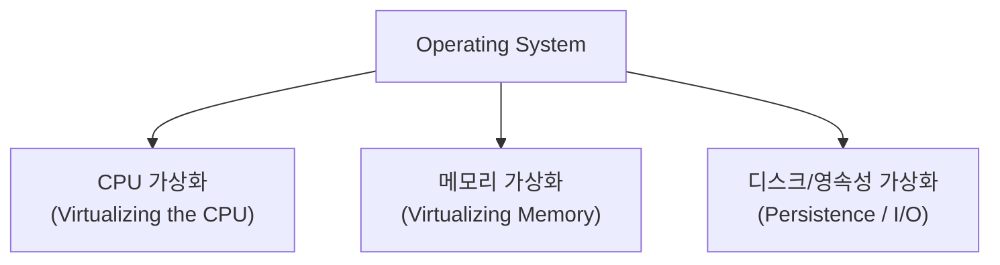

| 자원 | 가상화 결과 | 비유 |
|---|---|---|
| **CPU** | 여러 프로세스가 동시에 실행되는 것처럼 보임 | 물리 CPU는 1개지만 "내가 CPU를 전부 쓰는 것처럼" 느낌 |
| **Memory** | 각 프로세스가 자신만의 독립된 주소공간(0번지부터 시작하는 것처럼)을 가짐 | 다른 프로세스의 메모리는 보이지도, 침범하지도 못함 |
| **Disk / Persistence** | 여러 프로세스·사용자가 같은 디스크를 마치 독점하듯 파일시스템으로 사용 | 파일 시스템이 물리 블록 배치를 숨겨줌 |

이번 스터디는 이 중 **CPU 가상화**, 그리고 그 단위가 되는 **프로세스(Process)** 자체에 집중한다. 메모리/디스크 가상화는 이후 스터디에서 깊게 다룬다(12장에서 짧게 미리보기만 한다).

### 0.3 Time Sharing vs Space Sharing

자원을 가상화하는 방법은 크게 두 가지로 나뉜다.

- **Time Sharing (시간 분할)**: 자원을 시간 단위로 잘라서 번갈아 쓰게 한다. CPU 가상화가 대표적 — 한 프로세스가 CPU를 잠깐 쓰고, 다음 프로세스가 또 잠깐 쓰는 식.
- **Space Sharing (공간 분할)**: 자원을 공간(주소/영역) 단위로 잘라서 나눠준다. 디스크가 대표적 — 디스크의 특정 블록은 한 번 어떤 파일에 할당되면, 그 공간은 다른 파일과 동시에 공유되지 않는다.

CPU는 기본적으로 **Time Sharing** 자원이다. 그런데 왜 CPU는 공간 분할이 아니라 시간 분할로 가상화할까? — CPU는 한번 코드를 실행하기 시작하면 그 명령어가 끝날 때까지 "잘라서" 동시에 두 일을 할 수 없는 직렬적 자원이기 때문이다. 반면 메모리나 디스크는 주소 공간을 잘라 동시에 "공간적으로" 나눠줄 수 있다.

---

## 1. Process란 무엇인가

**"프로세스를 실행한다"** 는 말은 정확히 무슨 뜻일까?

실제로 CPU가 프로세스를 실행한다는 것은, 다음의 사이클을 끊임없이 반복하는 것이다.

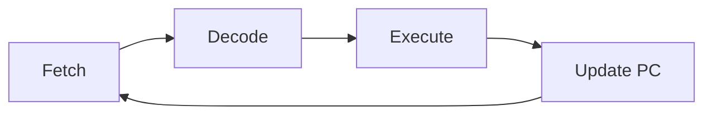

- **Fetch**: 메모리에서 명령어(instruction)를 가져온다.
- **Decode**: 가져온 명령어가 무엇을 의미하는지 해석한다.
- **Execute**: 해석한 명령어를 실제로 수행한다.
- **Update PC**: Program Counter를 다음 명령어 주소로 갱신한다.

즉, 프로세스의 실행이란 이 4단계 사이클이 처음부터 끝까지 셀 수 없이 반복되는 것이다.

---

## 2. Multiple Process와 CPU

실제 컴퓨터는 하나의 프로세스만 실행하지 않는다. 동시에 여러 개의 프로세스가 떠 있고, 우리는 이를 자연스럽게 사용한다.

그런데 **CPU(코어)의 개수는 한정**되어 있다. 그렇다면 CPU는 어떻게 여러 프로세스를 동시에 처리하는 것처럼 보이게 할까?

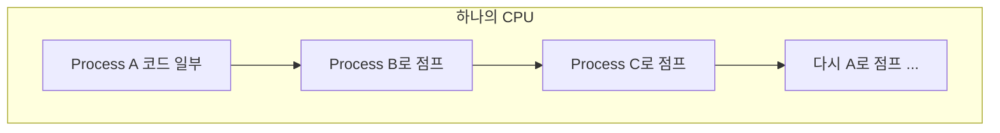

CPU는 프로세스 A를 조금 실행하다가 B의 코드로 점프하고, 다시 C로 점프하는 식으로 빠르게 왔다 갔다 한다.

> ⚠️ **주의**: 이 그림만으로는 아직 "가상화(Virtualization)"라고 부르지 않는다. 단순히 CPU가 여러 코드 사이를 옮겨 다니는 모습일 뿐이고, **누가, 어떻게 이 전환을 통제하는지**가 빠져 있기 때문이다.

---

## 3. CPU의 가상화 (Virtualizing the CPU)

핵심은 **"누가 이 전환을 결정하는가"** 이다. 바로 **운영체제(OS)** 다.

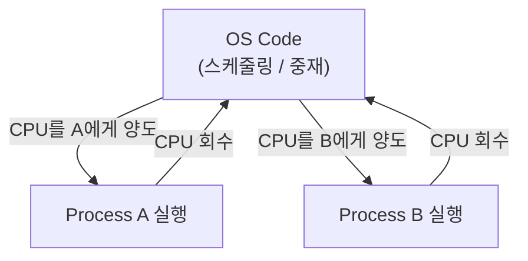

OS의 코드가 실제로 존재하고, OS는 필요에 따라

1. Code A에게 CPU 사용 권한을 **넘겨준다**
2. 일정 시간 또는 이벤트 후 CPU를 다시 **회수한다**
3. Code B에게 CPU를 **넘겨준다**
4. 다시 **회수**한다
5. (반복)

이 과정을 빠르게 반복함으로써, 사용자에게는 마치 **여러 개의 CPU가 동시에 여러 프로세스를 실행하는 것처럼** 보이게 만든다.

> 💡 이것이 바로 **CPU 가상화(CPU Virtualization)** 의 핵심 개념이다.
> 물리적으로는 CPU가 하나(또는 적은 수)뿐이지만, OS가 빠르게 전환해주기 때문에 사용자/프로세스 입장에서는 "내가 CPU를 독점하고 있다"고 느끼게 된다.

---

## 4. 메커니즘과 정책: 가상화를 구현하는 두 축

OS가 CPU를 가상화하려면 두 가지 서로 다른 종류의 질문에 답해야 한다. OSTEP에서는 이를 **메커니즘(Mechanism)**과 **정책(Policy)**으로 구분한다.

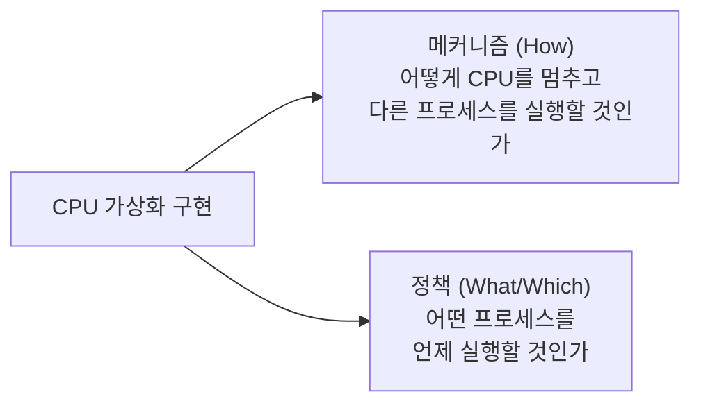

| 구분 | 질문 | 예시 |
|---|---|---|
| **메커니즘 (Mechanism)** | "어떻게(How)" 그 기능을 구현하는가 — 저수준의 동작/절차 | Context Switching, Timer Interrupt, Trap 처리 |
| **정책 (Policy)** | "무엇을(What)" 할지 결정하는 의사결정 알고리즘 | 어떤 프로세스를 다음에 실행할지 정하는 스케줄링 알고리즘 (FIFO, Round Robin, MLFQ 등) |

이 둘을 분리해서 생각하는 것이 중요한 이유는, **메커니즘은 한 번 잘 만들어두면 재사용되고, 정책은 그 메커니즘 위에서 비교적 자유롭게 바꿔 끼울 수 있기 때문**이다. 예를 들어 "Context Switch를 어떻게 안전하게 수행할 것인가"(메커니즘)는 거의 고정되어 있지만, "다음에 어떤 프로세스를 골라 실행할 것인가"(정책)는 스케줄러를 교체함으로써 자유롭게 바꿀 수 있다.

> 🔍 이번 스터디에서 다루는 fork(), Context Switching, Process States는 대부분 **메커니즘**에 해당한다. **정책**(스케줄링 알고리즘)은 다음 스터디에서 별도로 깊게 다룰 예정이다.

---

## 5. Process Creation

프로세스가 생성되는 과정은 다음과 같은 순서로 이루어진다.

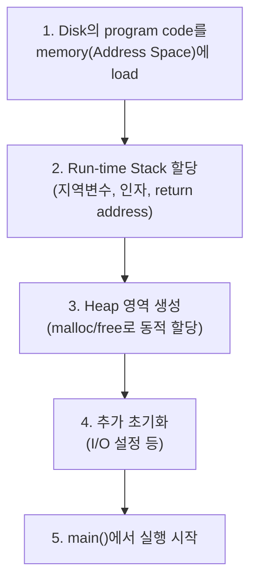

| 단계 | 설명 |
|---|---|
| 1. Code Load | 디스크에 저장된 프로그램 코드를 메모리(프로세스의 address space)로 적재 |
| 2. Stack 할당 | 지역 변수, 함수 인자, return address 등을 저장하는 run-time stack 할당 |
| 3. Heap 생성 | 동적 할당 요청(`malloc()`, `free()`)에 대응하는 힙 영역 생성 |
| 4. 초기화 | I/O 설정 등 OS가 수행하는 추가적인 초기화 작업 |
| 5. 실행 시작 | `main()` 함수에서부터 프로그램 실행 시작 |

### 5.1 Address Space의 내부 구조

위 과정을 거치고 나면, 프로세스는 다음과 같은 모양의 **주소 공간(Address Space)**을 갖게 된다. 이 구조는 메모리 가상화를 다룰 때 다시 깊게 볼 내용이지만, 지금 단계에서 큰 그림만 잡아두자.

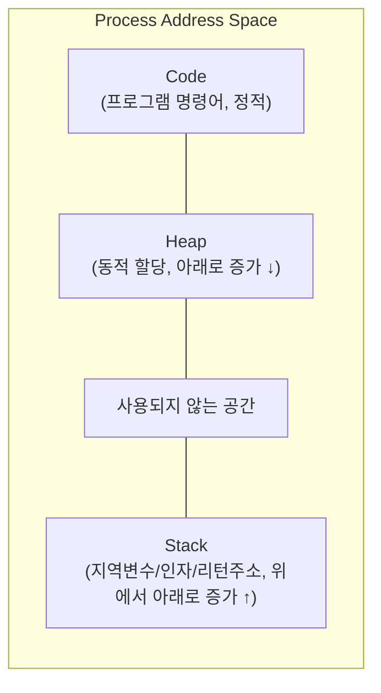

- **Code**: 컴파일된 프로그램의 명령어. 보통 주소 공간의 가장 아래쪽에 위치하며 실행 중 거의 바뀌지 않는다(정적).
- **Heap**: `malloc()`/`free()`(C 기준)로 요청하는 동적 메모리. 주소가 낮은 쪽에서 위로 자라난다.
- **Stack**: 함수 호출 시마다 쌓이는 **스택 프레임(stack frame)** — 지역 변수, 함수 매개변수, 리턴 주소를 담는다. 주소가 높은 쪽에서 아래로 자라난다.
- Heap과 Stack이 서로 반대 방향으로 자라나는 이유는, 둘 다 **얼마나 커질지 미리 알 수 없기 때문**에 가운데 빈 공간을 함께 사용하도록 설계한 것이다.

> ⚠️ 여기서 중요한 점: 프로세스가 보는 이 address space는 **가상 주소(virtual address)**다. 즉 프로세스는 "내가 0번지부터 시작하는 메모리를 통째로 쓰고 있다"고 믿지만, 실제로는 OS와 하드웨어(MMU)가 이 가상 주소를 물리 메모리의 실제 위치로 **매핑(mapping)**해준다. 이것이 **메모리 가상화**의 본질이며, 다음 스터디 주제로 이어진다.

---

## 6. Process Control Block과 운영체제의 시점

### 6.1 OS는 프로세스를 어떻게 "기억"하는가

CPU 가상화가 동작하려면, OS는 현재 시스템에 떠 있는 모든 프로세스에 대한 정보를 어딘가에 저장해두어야 한다. 이 정보를 담는 자료구조를 **PCB(Process Control Block)**, 또는 리눅스에서는 `task_struct`라고 부른다.

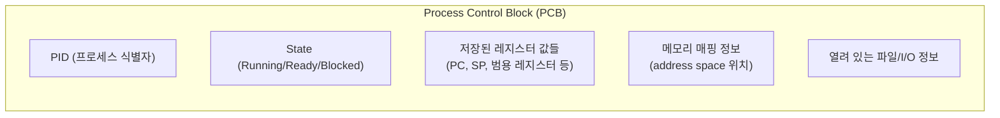

PCB에는 대략 다음과 같은 정보가 들어간다.

| 필드 | 설명 |
|---|---|
| PID (Process ID) | 프로세스를 구분하는 고유 식별자 |
| State | 현재 Running / Ready / Blocked 중 어느 상태인지 |
| 저장된 레지스터 값 | 이 프로세스가 CPU를 양도(Context Switch)할 당시의 PC, Stack Pointer, 범용 레지스터 값들 |
| 메모리 정보 | 이 프로세스의 address space가 물리 메모리 어디에 매핑되어 있는지 |
| I/O / 파일 정보 | 열려 있는 파일 디스크립터 등 |

이 PCB가 바로 "OS가 각 프로세스를 추적하는 단위"다. OS 내부에는 이 PCB들을 모아둔 **프로세스 리스트(process list)**가 있고, 스케줄러는 이 리스트를 보면서 "다음에 누구를 실행할지" 정책을 적용한다.

> 💡 6장의 PCB 개념을 알고 나면, 다음에 나올 **Context Switching**(10장)이 정확히 무엇을 저장하고 복원하는지 — 바로 이 PCB 안의 "저장된 레지스터 값"이라는 것이 분명해진다.

---

## 7. fork() 함수

### 7.1 fork()란?

`fork()` 는 **현재 수행 중인 프로세스를 복제**하는 시스템 콜이다.

이때 두 가지 개념이 등장한다.

- **Parent process**: `fork()`를 호출한 원래 프로세스
- **Child process**: `fork()`에 의해 새로 생성된 복제 프로세스

프로세스 A가 실행 중 `fork()`를 호출하면, **그 시점까지 A가 가지고 있던 상태(메모리, 레지스터 등)를 그대로 복제**하여 Child 프로세스(B)가 만들어진다.

### 7.2 fork() 이후의 동작

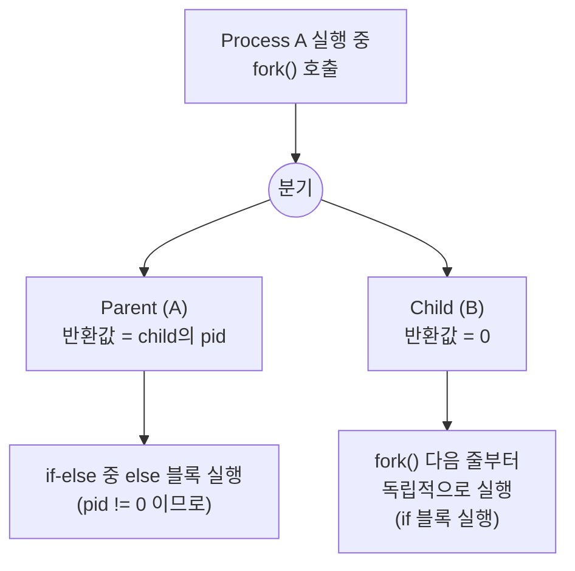

핵심 포인트:

- `fork()` 가 **성공**하면:
  - **Parent**는 새로 생성된 **child의 pid 값**을 반환받는다.
  - **Child**는 **0**을 반환받는다.
- 이 반환값으로 `if (pid == 0) { ... } else { ... }` 와 같은 분기를 통해 부모와 자식이 서로 다른 코드를 실행하도록 만들 수 있다.
- Child 프로세스는 `fork()` 호출 **그 다음 문장부터** 실행을 시작한다 (그 이전 상태는 이미 복제되어 있으므로).
- 일반적으로 Parent의 else 문이 먼저 실행되고, Parent 프로세스가 끝난 후 Child(B)가 if 블록의 문장들을 수행하게 된다 (실행 순서는 스케줄링에 따라 달라질 수 있음).

### 7.3 Process Hierarchy

하나의 프로세스는 `fork()`를 통해 또 다른 프로세스를 계속 만들어낼 수 있기 때문에, 프로세스 사이에는 **계층 구조(hierarchy)** 가 형성된다.

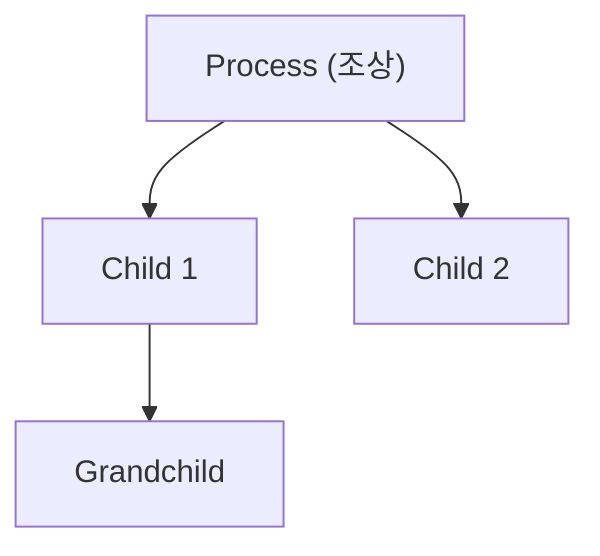

Unix 계열 시스템에서는 이러한 부모-자식 관계로 묶인 프로세스 집합을 **"process group"** 이라고 부른다.

> 🔍 추가로 알아두면 좋은 점: 부모 프로세스가 먼저 종료되면 자식 프로세스는 보통 **init(또는 systemd) 프로세스에게 입양(reparenting)**되어 고아 프로세스(orphan)가 되지 않도록 처리된다. 부모가 자식의 종료를 어떻게 알아채는지(`wait()`)와 좀비 프로세스 문제는 8.2에서 자세히 다룬다.

---

## 8. fork()와 exec()의 관계, 그리고 Copy-on-Write

fork()만 가지고는 "완전히 다른 프로그램"을 실행할 수 없다. fork()는 **자기 자신을 복제**할 뿐이기 때문이다. 그렇다면 셸(shell)에서 `ls`나 `vim` 같은 전혀 다른 프로그램을 어떻게 새 프로세스로 띄울까? 여기서 `exec()` 계열 함수가 등장한다.

```mermaid
flowchart LR
    Shell["Shell 프로세스"]
    Shell -->|"fork()"| Child["Child 프로세스\n(Shell의 복제본)"]
    Child -->|"exec(\"ls\", ...)"| New["Child의 address space가\nls 프로그램으로 통째로 교체됨"]
    New --> Run["ls 실행"]
```

| 함수 | 역할 |
|---|---|
| `fork()` | 현재 프로세스를 **복제**한다. 부모와 자식 모두 **같은 코드**를 계속 실행한다. |
| `exec()` | 현재 프로세스의 **address space(코드, 데이터)를 완전히 다른 프로그램으로 덮어쓴다.** PID는 유지되지만, 실행되는 프로그램 자체가 바뀐다. `exec()` 호출 후에는 원래 프로그램으로 절대 돌아오지 않는다(성공 시 리턴하지 않음). |

이 두 함수가 분리되어 있는 것이 Unix 설계의 유명한 특징이다. **"복제(fork)"와 "다른 프로그램으로 교체(exec)"를 분리**해두었기 때문에, 그 중간 지점(fork 직후, exec 직전)에서 셸이 자유롭게 **출력 리다이렉션, 파이프 연결** 같은 작업을 끼워 넣을 수 있다.

```c
// 셸이 명령어를 실행하는 전형적인 패턴 (의사 코드)
pid_t pid = fork();
if (pid == 0) {
    // 자식: 여기서 출력 리다이렉션 등을 설정한 뒤
    exec("/bin/ls", "ls", "-l", NULL);  // ls로 완전히 교체
} else {
    wait(NULL); // 부모: 자식이 끝날 때까지 대기
}
```

> 💡 **왜 fork()와 exec()를 합쳐서 하나의 함수(예: `spawn()`)로 만들지 않았을까?**
> 정답은 "그 사이에 끼워 넣을 작업이 있기 때문"이다. fork 직후 child 프로세스에서 파일 디스크립터를 재설정(예: stdout을 파일로 연결)한 다음 exec를 호출하면, **exec되는 프로그램은 자신의 출력이 리다이렉션되고 있다는 사실조차 모르게** 만들 수 있다. 이것이 셸의 `>`, `|` 같은 기능이 동작하는 원리다.

### 8.1 fork()는 실제로 메모리를 통째로 복사할까? — Copy-on-Write (COW)

7장에서 "child는 parent의 상태를 그대로 복제받는다"고 했다. 그런데 이걸 **문자 그대로** 구현하면 문제가 생긴다.

- parent의 address space가 수백 MB~수 GB라면, `fork()` 한 번에 그만큼을 통째로 복사해야 한다.
- 게다가 대부분의 `fork()`는 **바로 직후 `exec()`로 이어진다** (8장 앞부분의 패턴처럼). 그렇다면 방금 복사한 메모리는 `exec()`가 호출되는 즉시 **버려진다.** 복사 자체가 헛수고가 되는 경우가 매우 흔하다.

이 비효율을 없애기 위해 실제 OS(Linux 등)는 **Copy-on-Write(COW)** 기법을 쓴다.

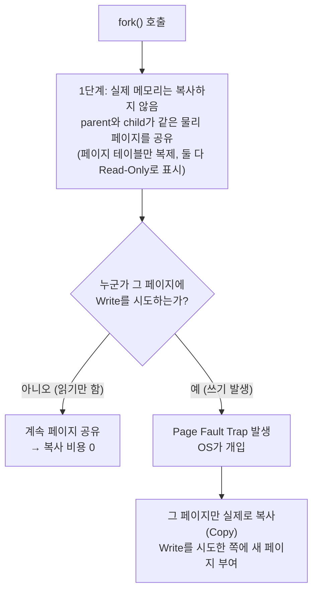

핵심 동작 순서:

1. `fork()` 호출 시점에는 **물리 메모리를 복사하지 않는다.** parent와 child의 페이지 테이블이 **같은 물리 페이지**를 가리키도록만 설정하고, 그 페이지들을 모두 **Read-Only**로 표시한다.
2. 둘 중 누구든 그 페이지를 **읽기만** 하면 아무 문제가 없다 — 어차피 내용이 같으므로 공유해도 무방하다.
3. 한쪽(parent든 child든)이 그 페이지에 **쓰기(write)**를 시도하면, 하드웨어가 Read-Only 위반을 감지해 **Page Fault**를 발생시킨다.
4. OS는 이 Page Fault를 trap으로 받아, **그 순간에만** 해당 페이지를 실제로 복사한 뒤, 쓰기를 시도한 쪽에 새로 복사된 페이지를 연결해준다. 이후 그 페이지는 더 이상 공유되지 않는다.

> 💡 이름이 "Copy-**on**-Write"인 이유가 바로 이것이다 — **복사는 fork() 시점이 아니라, 실제로 쓰기가 일어나는 시점에만** 지연되어(lazily) 일어난다.

**COW가 가져오는 이득**:

| 시나리오 | Naive fork (전체 복사) | COW fork |
|---|---|---|
| fork() 직후 바로 exec() | 복사한 메모리 전부 버림 → 낭비 | 복사 자체가 없었으므로 낭비 없음 |
| parent/child가 메모리 대부분을 읽기만 함 | 불필요하게 전체 복사 | 실제 write가 일어난 페이지만 복사 |
| 메모리 사용량이 큰 프로세스 | fork() 자체가 매우 느림 | fork()가 거의 즉시 끝남 (페이지 테이블만 조정) |

> 🔍 COW는 fork()에만 쓰이는 기법이 아니다. 가상 메모리 시스템 전반에서 "당장 필요하지 않은 작업은 미루고, 실제로 필요해지는 순간(쓰기 시점)에 처리한다"는 **lazy 전략**의 대표적인 예이며, 이후 메모리 가상화 스터디에서 다시 만나게 될 개념이다.

### 8.2 wait()와 좀비 프로세스, 그리고 Process API의 나머지 조각들

`fork()`/`exec()`만으로는 Process API가 완성되지 않는다. 부모가 자식의 종료를 어떻게 알아채는지도 필요하다.

| 함수 | 역할 |
|---|---|
| `wait()` / `waitpid()` | 부모가 **자식 프로세스의 종료를 기다린다.** 자식이 종료 상태(exit status)를 남기면 부모가 이를 수거(reap)할 수 있다. |
| `exit()` | 프로세스가 스스로 종료하며 **종료 코드(exit status)**를 OS(정확히는 부모가 읽을 수 있는 PCB)에 남긴다. |
| `kill()` / signal | 다른 프로세스에게 **시그널(signal)**을 보내 종료 요청, 일시정지 등을 지시한다. |

**좀비 프로세스(zombie process)**가 생기는 정확한 메커니즘은 이렇다:

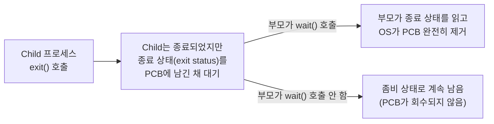

- 자식이 `exit()`하면, 프로세스는 더 이상 실행되지 않지만 **부모가 종료 상태를 가져갈 때까지 PCB(7번 참고)는 즉시 제거되지 않는다.** 이 상태가 바로 좀비(zombie)다.
- 부모가 `wait()`를 호출하면 OS가 그 종료 상태를 부모에게 넘겨주고, 그제서야 PCB를 완전히 정리(reap)한다.
- 만약 부모가 `wait()`를 영원히 호출하지 않으면(또는 부모가 먼저 죽어버리면), 좀비가 시스템에 누적되어 **PID 자원을 계속 점유**하게 된다. PID는 유한한 자원이므로, 좀비가 쌓이면 결국 새 프로세스를 만들 수 없는 상황까지 이어질 수 있다.

---

## 9. Process States

프로세스는 실행되는 동안 다음 세 가지 상태 중 하나를 가진다.

| 상태 | 설명 |
|---|---|
| **Running** | 프로세스가 실제로 프로세서(CPU)에서 실행되고 있는 상태 |
| **Ready** | 실행될 준비는 끝났지만, 아직 OS의 선택을 받지 못해 CPU를 점유하지 못한 상태 |
| **Blocked** | I/O 요청 등으로 인해 당장 아무것도 할 수 없는 상태. 예: 키보드 입력을 기다리는 중. 이 동안 CPU는 다른 프로세스에게 양도된다. 입력이 끝나면 Ready 상태로 전환되어 다시 OS의 스케줄링을 기다린다. |

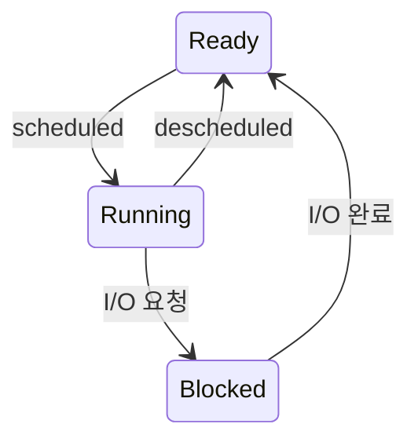

> 정리하면: **Ready ↔ Running** 사이는 OS의 스케줄링 결정에 의해 오가고, **Running → Blocked**는 자기 자신이 I/O 등을 요청했을 때, **Blocked → Ready**는 그 요청이 완료되었을 때 발생한다.

### 9.1 두 프로세스가 동시에 CPU/I/O를 다툴 때

두 프로세스(예: Process 0, Process 1)가 함께 실행되면서 한쪽이 I/O를 요청하는 경우, 시간 순서대로 상태가 어떻게 바뀌는지 추적해보면 OS의 역할이 더 분명해진다.

| 시간 | Process 0 | Process 1 | 설명 |
|---|---|---|---|
| t1 | Running | Ready | Process 0가 CPU 사용 중, Process 1은 대기 |
| t2 | Running | Ready | Process 0 계속 실행 |
| t3 | **Blocked** (I/O 요청) | **Running** | Process 0가 I/O를 요청하며 Blocked로 전환 → OS가 즉시 Process 1을 Running으로 전환하여 CPU 낭비를 막음 |
| t4 | Blocked | Running | Process 0는 I/O 완료를 기다리는 중 |
| t5 | **Ready** (I/O 완료) | Running | I/O가 끝나 Process 0는 Ready로 전환되지만, 아직 CPU는 Process 1이 사용 중이므로 곧바로 Running은 아님 |
| t6 | Ready | **Blocked** 또는 종료 | 상황에 따라 Process 1도 I/O를 요청하거나 종료하면서 Process 0가 다시 스케줄링됨 |

이 표가 보여주는 OS의 핵심 역할 세 가지:

1. **CPU 자원 최적화**: 한 프로세스가 Blocked 상태일 때 CPU를 그냥 놀리지 않고, 다른 Ready 프로세스에게 즉시 넘겨 자원 낭비를 막는다.
2. **I/O와 CPU의 병행 처리(Overlap)**: Process 0가 I/O 장치의 응답을 기다리는 동안, CPU는 동시에 Process 1의 계산을 수행한다. 이렇게 I/O와 CPU 연산이 겹쳐서 진행되는 것을 **I/O와 CPU의 오버랩(overlap)**이라 하며, 시스템 전체 처리량(throughput)을 높이는 핵심 전략이다.
3. **상태 전이의 정확한 관리**: Running → Blocked → Ready로의 전이가 정확한 타이밍에 일어나야, 어떤 프로세스도 "준비됐는데 영원히 대기"하거나 "끝났는데 자원을 계속 점유"하는 일이 없다.

---

## 10. Context Switching

**Context Switching**이란, CPU가 한 프로세스에서 다른 프로세스로 전환되는 것을 말한다.

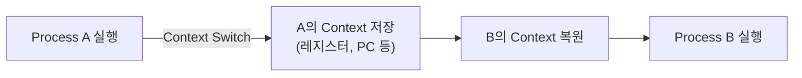

- 새로운 프로세스가 CPU에서 정상적으로 동작하려면, **레지스터 값, PC, 메모리 매핑 정보 등 실행 환경 전체를 새 프로세스에 맞게 맞춰주어야** 한다.
- 이 과정에는 필연적으로 **오버헤드(overhead)** 가 발생한다 (이전 프로세스의 상태 저장 + 새 프로세스의 상태 복원).
- 이 오버헤드는 순수 소프트웨어만으로 처리하면 비용이 크기 때문에, **하드웨어의 도움**(예: 레지스터 저장을 가속하는 전용 명령어, MMU 등)을 받아야 크게 줄일 수 있다.

### 10.1 Context Switch는 정확히 무엇을 저장/복원하는가

6장에서 본 PCB를 떠올려보자. Context Switch는 결국 다음을 수행하는 것이다.

1. 현재 실행 중인 프로세스 A의 **레지스터 값(PC, Stack Pointer, 범용 레지스터들)**을 A의 PCB에 **저장(save)**한다.
2. 다음에 실행할 프로세스 B의 PCB에서 **저장되어 있던 레지스터 값을 읽어와 실제 하드웨어 레지스터에 복원(restore)**한다.
3. PC를 B가 멈췄던 지점으로 옮기고 실행을 재개한다.

이 저장/복원 작업은 **OS의 코드(저수준 어셈블리)**가 직접 수행하며, 일반적으로 `switch()` 또는 `context_switch()`라 불리는 루틴으로 구현된다.

### 10.2 누가 Context Switch를 트리거하는가

Context Switch는 아무 때나 일어나지 않는다. 보통 다음과 같은 계기로 발생한다.

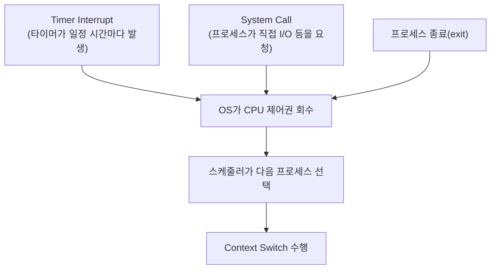

- **Timer Interrupt**: 하드웨어 타이머가 일정 주기(예: 수 ms)마다 인터럽트를 발생시켜, 프로세스가 자발적으로 양보하지 않아도 OS가 강제로 제어권을 가져올 수 있게 한다. 이것이 없으면 한 프로세스가 무한루프에 빠질 경우 시스템 전체가 멈춰버린다.
- **System Call**: 프로세스가 `read()`, `write()` 등을 호출하면 자연스럽게 커널 모드로 전환되고, 이 과정에서 OS가 스케줄링 여부를 판단할 기회를 얻는다.
- **프로세스 종료**: 더 이상 실행할 코드가 없으므로 당연히 다른 프로세스에게 CPU를 넘겨야 한다.

---

## 11. Limited Direct Execution: 가상화는 어떻게 "거의 공짜"로 동작하는가

지금까지의 설명을 들으면 한 가지 의문이 생길 수 있다 — *"매번 OS가 끼어들어서 CPU를 가로채고 넘겨주는 거라면, 너무 느리지 않을까?"*

OSTEP에서 소개하는 핵심 기법이 바로 **Limited Direct Execution(LDE)**이다. 핵심 아이디어는: **"대부분의 시간 동안은 OS가 개입하지 않고, 프로세스가 하드웨어 위에서 직접(Direct) 실행되도록 한다."**

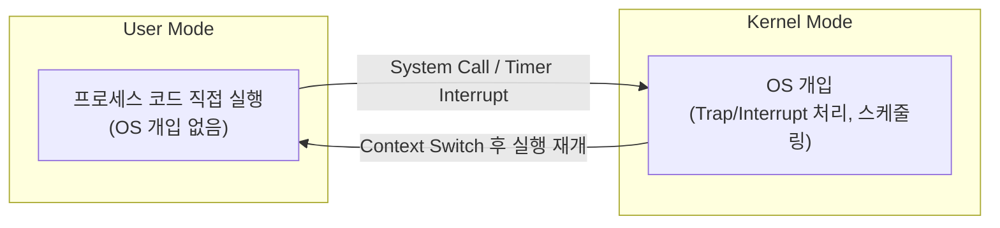

### 11.1 왜 "Limited"인가?

만약 프로세스가 **완전히 제한 없이(Unlimited)** 직접 실행된다면, 다음과 같은 문제가 생긴다.

- 프로세스가 다른 프로세스의 메모리를 마음대로 읽고 쓸 수 있다.
- 프로세스가 디스크나 네트워크 같은 자원을 무단으로 직접 제어할 수 있다.
- 프로세스가 영원히 CPU를 놓지 않을 수 있다 (위에서 본 Timer Interrupt가 막아준다).

이런 위험한 동작들을 막기 위해, CPU는 **User Mode**와 **Kernel Mode**라는 두 가지 실행 모드를 구분한다.

| 모드 | 설명 |
|---|---|
| **User Mode** | 일반 프로세스가 실행되는 모드. 제한된 명령어만 사용 가능하며, 특권 명령어(I/O 직접 제어, 메모리 보호 설정 변경 등)는 실행할 수 없다. |
| **Kernel Mode** | OS 코드가 실행되는 모드. 모든 하드웨어 자원에 접근할 수 있는 특권 모드. |

프로세스가 특권이 필요한 작업(파일 읽기 등)을 하려면, **System Call**을 통해 **Trap**을 발생시켜 User Mode → Kernel Mode로 전환해야 한다. 작업이 끝나면 다시 User Mode로 복귀(`return-from-trap`)한다.

### 11.2 Trap Table: 누가 trap 핸들러의 주소를 정하는가

여기서 보안상 매우 중요한 질문이 하나 남는다. *"User Mode 프로세스가 System Call을 호출했을 때, 정확히 커널의 어느 코드로 점프해야 하는지는 누가 정할까?"*

직관적으로는 "프로세스가 점프할 주소를 직접 지정하면 되지 않나?"라고 생각할 수 있지만, **이건 절대 허용되면 안 된다.** 만약 User 프로세스가 점프 주소를 마음대로 정할 수 있다면, 악성 코드가 커널 모드로 진입한 뒤 임의의 커널 코드(예: 권한 검사를 건너뛰는 지점)로 점프해버리는 것을 막을 수 없다.

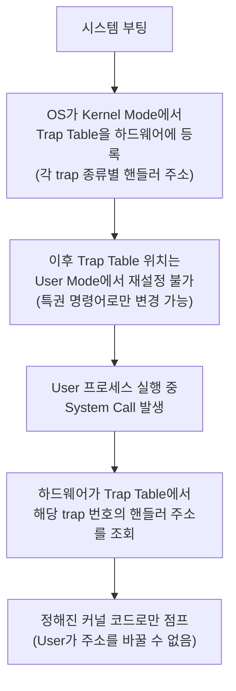

핵심 원리:

1. **부팅 시점**에 OS는 Kernel Mode에서 한 번, **Trap Table**(트랩 핸들러들의 주소 목록)을 하드웨어(CPU)에 등록한다.
2. 이 등록 작업 자체가 **특권 명령어**이기 때문에, 한 번 등록된 이후로는 User Mode 코드가 이 테이블을 변경할 수 없다.
3. User 프로세스가 System Call(예: `read()`)을 호출하면, 실제로는 `trap` 명령어가 실행되며 **trap 번호**를 CPU에 넘긴다.
4. 하드웨어는 미리 등록된 Trap Table에서 그 번호에 해당하는 **고정된 커널 주소**를 찾아 그곳으로만 점프한다 — User가 임의의 주소로 점프시킬 방법이 없다.

> 💡 이것이 바로 "Limited"의 진짜 의미 중 하나다. User 프로세스는 trap을 **발생시킬 수만** 있고, trap이 **어디로 이어지는지는 전혀 통제하지 못한다.** 통제권은 철저히 부팅 시점에 OS가 미리 고정해둔다.

### 11.3 Non-Cooperative 환경: 프로세스가 스스로 CPU를 놓지 않으면 어떻게 되는가

초기 운영체제 일부는 **Cooperative(협조적) 방식**을 썼다 — 프로세스가 System Call을 호출하거나 스스로 `yield()`를 호출해야만 OS가 제어권을 가져올 수 있었다. 문제는, **프로세스가 무한루프에 빠지거나 악의적으로 CPU를 놓지 않으면, OS조차 개입할 방법이 없다**는 것이다.

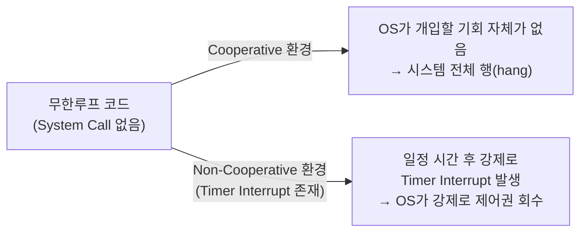

이 문제의 해결책이 앞서 10.2에서 본 **Timer Interrupt**다. 하드웨어 타이머가 프로세스의 협조 여부와 무관하게 **일정 주기마다 무조건 interrupt를 발생**시키기 때문에, 어떤 프로세스도 CPU를 영원히 독점할 수 없다. 이를 **Non-Cooperative 방식**이라 부르며, 현대 OS는 거의 예외 없이 이 방식을 사용한다.

### 11.4 Concurrency 문제: Context Switch 도중에 Timer Interrupt가 또 발생하면?

Limited Direct Execution을 구현할 때 가장 까다로운 지점 중 하나가 바로 이것이다 — **Context Switch 코드 자체를 실행하고 있는 도중에, 또 다른 인터럽트(특히 Timer Interrupt)가 발생하면 어떻게 될까?**

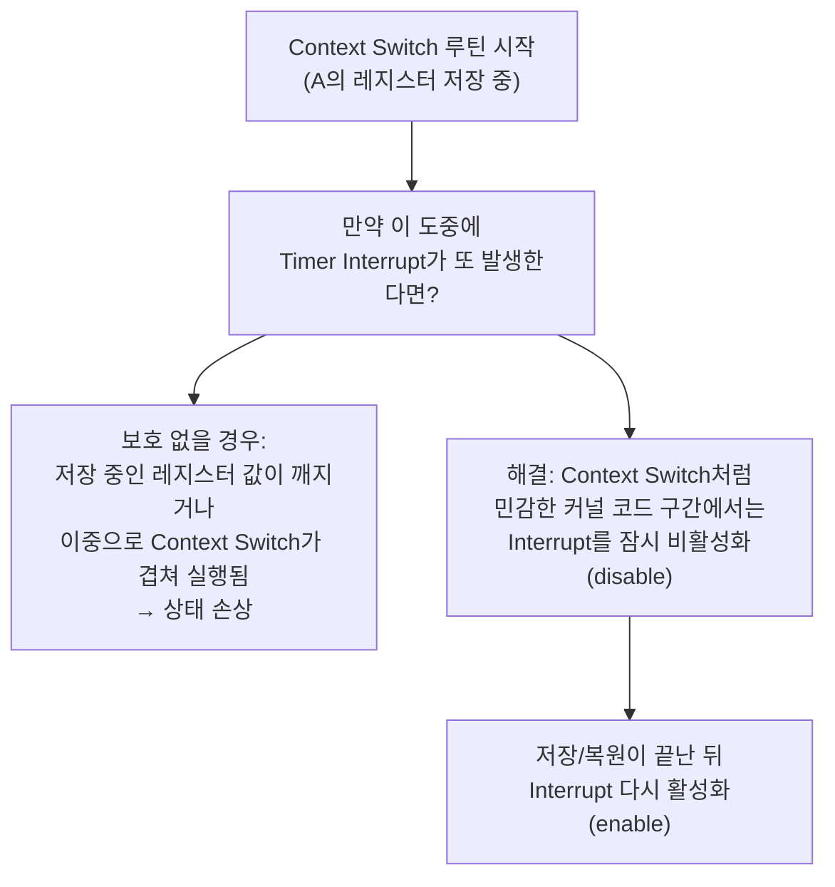

이런 상황은 **동시성(concurrency) 버그**의 전형적인 예다 — 똑같이 "공유된 상태(레지스터, PCB)를 건드리는 코드"가 인터럽트에 의해 중간에 끼어들면서 예측 불가능한 결과를 낳을 수 있다.

해결책은 비교적 단순하다: **OS는 Context Switch처럼 민감한(critical) 코드 구간을 실행하는 동안, 일시적으로 인터럽트를 비활성화(disable interrupts)한다.** 이 구간이 끝나면 다시 인터럽트를 활성화한다.

> 🔍 이것은 **운영체제 전체에 반복적으로 등장하는 패턴**이다 — "여러 실행 흐름이 같은 데이터를 동시에 건드릴 수 있는 위험 구간(critical section)은, 그 구간만큼은 인터럽트나 다른 스레드의 개입을 막아 원자적(atomic)으로 처리한다." 이 주제는 이후 **동시성(Concurrency)** 스터디에서 락(lock), 세마포어 등으로 훨씬 본격적으로 다루게 된다. 지금 단계에서는 "Context Switch도 공짜로 안전해지는 게 아니라, 의도적으로 인터럽트를 막는 구간이 필요하다"는 사실만 기억해두면 충분하다.

### 11.5 정리: 가상화가 "거의 공짜"인 이유

- 대부분의 명령어는 OS 개입 없이 **User Mode에서 그대로 하드웨어 위에서 직접 실행**된다 → 빠르다.
- OS는 **Timer Interrupt, System Call** 같은 제한된 진입점에서만 개입하여 제어권을 회수한다 → 안전성과 공정성을 보장한다.
- 이 "직접 실행 + 제한적 개입"의 조합이 바로 **Limited Direct Execution**이며, CPU 가상화가 현실적으로 작은 오버헤드만으로 동작할 수 있게 해주는 메커니즘이다.

---

## 12. CPU 가상화를 넘어서: 메모리, 디스크 가상화 맛보기

CPU 가상화의 짝이 되는 두 가지 가상화를 짧게 미리 보고 넘어가자 (각각 향후 스터디의 본 주제가 될 내용이다).

### 12.1 메모리 가상화 (Virtualizing Memory)

5.1에서 본 것처럼 각 프로세스는 자신만의 address space를 가진 것처럼 동작한다. 그런데 실제로 물리 메모리는 여러 프로세스가 공유한다.

```mermaid
flowchart LR
    subgraph Virtual["가상 주소공간 (프로세스 입장)"]
        VA["0x0000 ~ 0xFFFF\n(나만 쓰는 것처럼 보임)"]
    end
    subgraph Physical["물리 메모리 (실제)"]
        PA1["Process A의 영역"]
        PA2["Process B의 영역"]
        PA3["OS 영역"]
    end
    VA -->|"MMU가 주소 변환"| PA1
```

OS와 하드웨어(MMU, 페이지 테이블)가 협력하여 **가상 주소 → 물리 주소** 매핑을 관리하기 때문에, 각 프로세스는 "내가 메모리를 전부 갖고 있다"고 믿을 수 있으면서도, 실제로는 서로의 영역을 침범하지 못한다.

### 12.2 디스크/영속성 가상화 (Persistence)

디스크는 Time Sharing이 아니라 주로 **Space Sharing** 방식으로 가상화된다. 파일 시스템이 디스크의 물리적 블록 배치를 추상화하여, 사용자에게는 "파일과 디렉토리"라는 가상의 구조로 보여준다.

> 두 가상화 모두 이번 스터디의 범위를 넘어서지만, **"OS가 물리 자원을 추상화해서 보여준다"**는 핵심 아이디어는 CPU 가상화와 동일하다. 다음 스터디에서 메모리 가상화(주소 변환, 페이징)를 자세히 다룰 예정이다.

---

## 13. 정리 및 토론 포인트

### 핵심 요약

- **가상화**는 물리적으로 한정된 자원(CPU/메모리/디스크)을 OS가 시간적·공간적으로 나누어, 여러 사용자/프로세스가 독립적으로 자원을 가진 것처럼 느끼게 하는 기술이다.
- CPU 가상화는 대표적인 **Time Sharing** 방식이며, 프로세스 실행은 **Fetch-Decode-Execute-Update PC** 사이클의 반복이다.
- 가상화의 구현은 **메커니즘(어떻게)**과 **정책(무엇을)**으로 나눠 생각한다 — Context Switch는 메커니즘, 스케줄링 알고리즘은 정책.
- 프로세스는 **Code/Stack/Heap**으로 구성된 address space를 가지고 생성되며, OS는 이를 **PCB**로 추적·관리한다.
- `fork()`는 프로세스를 복제하며, **반환값(parent: child의 pid, child: 0)**으로 부모/자식을 구분한다. `exec()`는 현재 프로세스의 address space를 완전히 다른 프로그램으로 교체한다 — 둘을 분리해둔 덕분에 셸의 리다이렉션/파이프 기능이 가능하다.
- 실제 `fork()`는 메모리를 즉시 통째로 복사하지 않고 **Copy-on-Write(COW)**로 페이지 복사를 지연시킨다 — 쓰기가 발생하는 순간에만 Page Fault를 통해 그 페이지만 복사한다.
- `wait()`로 부모가 자식의 종료 상태를 수거(reap)하지 않으면 **좀비 프로세스**가 PCB를 점유한 채 시스템에 남는다.
- 프로세스는 **Running / Ready / Blocked** 세 상태를 오가며, OS는 Blocked 동안 CPU를 낭비하지 않고 다른 프로세스에 넘겨 **I/O와 CPU의 오버랩**을 만든다.
- 상태 전환 시 CPU 전환이 일어나면 **Context Switching**이 발생하며, 이는 PCB에 레지스터 값을 저장/복원하는 과정으로 구현된다.
- **Limited Direct Execution**: 평상시에는 프로세스가 User Mode에서 직접 실행되고, Timer Interrupt/System Call 같은 제한된 진입점에서만 OS(Kernel Mode)가 개입한다.
- **Trap Table**은 부팅 시점에 OS가 한 번만 등록하며, 이후 User 프로세스는 trap을 발생시킬 수만 있고 어디로 점프할지는 통제하지 못한다 — 이것이 보안의 핵심이다.
- **Non-Cooperative 방식**(Timer Interrupt)이 없으면 무한루프에 빠진 프로세스 하나가 시스템 전체를 멈출 수 있다.
- Context Switch처럼 민감한 커널 코드 구간에서는 **인터럽트를 일시적으로 비활성화**해, 동시성(concurrency) 문제로 상태가 손상되는 것을 막는다.

### 스터디에서 함께 이야기해볼 질문

1. CPU 가상화가 없다면(즉, OS의 중재가 없다면) 멀티태스킹은 왜 불가능할까?
2. `fork()` 호출 직후, 부모와 자식 중 어느 쪽이 먼저 실행될지는 보장되는가? 그렇다면 무엇이 결정하는가?
3. `fork()`와 `exec()`를 분리해둔 설계가 셸의 파이프(`|`)와 리다이렉션(`>`) 기능에 왜 필수적일까?
4. Copy-on-Write가 없다면, `fork()` 직후 곧바로 `exec()`하는 흔한 패턴에서 어떤 비효율이 생길까? 구체적으로 어느 시점에 낭비가 발생하는지 짚어보자.
5. Trap Table을 User Mode에서도 수정할 수 있게 허용한다면, 어떤 공격이 가능해질까?
6. Timer Interrupt가 없다면 어떤 문제가 생길까? (악의적이거나 버그가 있는 프로세스를 가정해보자) — 이를 Cooperative/Non-Cooperative 개념과 연결해서 설명해보자.
7. Context Switch 도중 인터럽트를 막아두지 않으면 정확히 어떤 데이터가 깨질 수 있을까?
8. User Mode와 Kernel Mode를 구분하지 않고 모든 프로세스가 Kernel Mode로만 실행된다면 어떤 보안 문제가 생길까?
9. Blocked 상태에 있는 프로세스가 많아지면 시스템 전체의 성능에는 어떤 영향을 줄까?
10. 좀비 프로세스가 누적되면 왜 결국 새로운 프로세스를 만들 수 없는 상황까지 갈 수 있을까? (PID 자원의 유한성과 연결해보자)